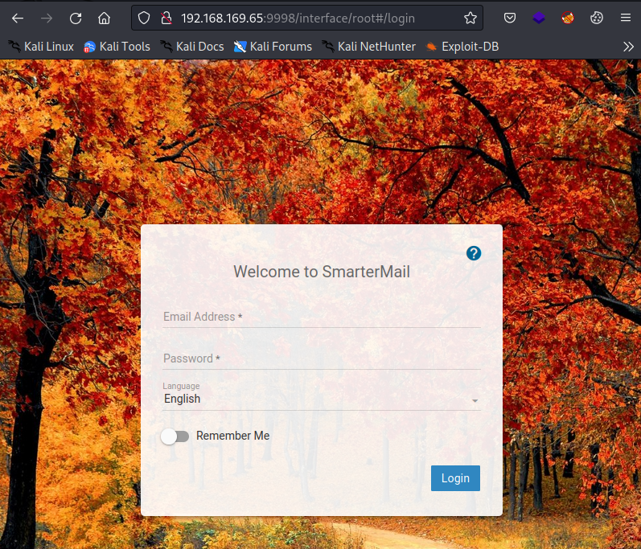
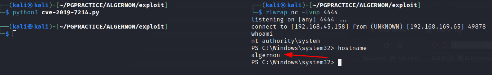

# Algernon

OS: Windows

# Nmap

After scanning for open ports we perform a script and version scan on the ports:

```sh
nmap -sC -sV -vv --min-rate 2000 -oA openscsv -p 21,80,135,139,445,5040,7680,9998,17001,49664,49665,49666,49667,49668,49669 192.168.169.65
Nmap scan report for 192.168.169.65
...
PORT      STATE SERVICE       REASON  VERSION
21/tcp    open  ftp           syn-ack Microsoft ftpd
80/tcp    open  http          syn-ack Microsoft IIS httpd 10.0
| http-methods: 
|_  Supported Methods: GET HEAD OPTIONS
|_http-title: IIS Windows
|_http-server-header: Microsoft-IIS/10.0
135/tcp   open  msrpc         syn-ack Microsoft Windows RPC
139/tcp   open  netbios-ssn   syn-ack Microsoft Windows netbios-ssn
445/tcp   open  microsoft-ds? syn-ack
5040/tcp  open  unknown       syn-ack
7680/tcp  open  pando-pub?    syn-ack
9998/tcp  open  distinct32?   syn-ack
|_uptime-agent-info: The script encountered an error: Error getting system info
| fingerprint-strings: 
|   teamspeak-tcpquery-ver: 
|     HTTP/1.1 400 Bad Request
|     Content-Type: text/html; charset=us-ascii
|     Server: Microsoft-HTTPAPI/2.0
|     Date: Thu, 24 Aug 2023 14:29:14 GMT
|     Connection: close
|     Content-Length: 326
|     <!DOCTYPE HTML PUBLIC "-//W3C//DTD HTML 4.01//EN""http://www.w3.org/TR/html4/strict.dtd">
|     <HTML><HEAD><TITLE>Bad Request</TITLE>
|     <META HTTP-EQUIV="Content-Type" Content="text/html; charset=us-ascii"></HEAD>
|     <BODY><h2>Bad Request - Invalid Verb</h2>
|     <hr><p>HTTP Error 400. The request verb is invalid.</p>
|_    </BODY></HTML>
17001/tcp open  remoting      syn-ack MS .NET Remoting services
49664/tcp open  unknown       syn-ack
49665/tcp open  unknown       syn-ack
49666/tcp open  unknown       syn-ack
49667/tcp open  unknown       syn-ack
49668/tcp open  unknown       syn-ack
49669/tcp open  unknown       syn-ack
1 service unrecognized despite returning data. If you know the service/version, please submit the following fingerprint at https://nmap.org/cgi-bin/submit.cgi?new-service :
SF-Port9998-TCP:V=7.93%I=7%D=8/24%Time=64E76B6C%P=x86_64-pc-linux-gnu%r(te
SF:amspeak-tcpquery-ver,1F9,"HTTP/1\.1\x20400\x20Bad\x20Request\r\nContent
.....
```


Port 9998 immediately stands out stands out. Let's visit the page:




What is smartermail?

> SmarterMail is an award-winning email, collaboration and group chat server  that easily meets the needs of any sized business, from the individual  proprietor to large corporations and enterprise organizations. 

If we look for vulenrabilties we find the following exploit:

https://raw.githubusercontent.com/devzspy/CVE-2019-7214/master/cve-2019-7214.py

The exploit is related to CVE-2019-7214 and has the following description:

> SmarterTools SmarterMail 16.x before build 6985 allows deserialization of untrusted data. An unauthenticated attacker could run commands on the server when port 17001 was remotely accessible. This port is not accessible remotely by default after applying the Build 6985 patch.

It says that it is a ‘allows deserialization of untrusted data’, it's a so called unsecure deserialization vulnerablity.  More information about this kind of vulnerability can be found here:

- https://www.techtarget.com/searchsecurity/definition/insecure-deserialization
- https://cheatsheetseries.owasp.org/cheatsheets/Deserialization_Cheat_Sheet.html#net-csharp


In the exploit we only need to change the IP of the remote host and the one of the localhost. Then we need to start a listener on port 4444.

If we run the exploit we gain a SYSTEM shell:



