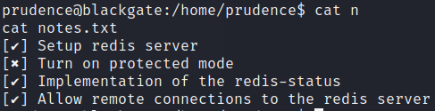

# BlackGate

OS: Linux

# Nmap

```sh
┌──(kali㉿kali)-[~/PGPRACTICE/BLACKGATE/recon/nmap]
└─$ cat init.nmap                  
# Nmap 7.93 scan initiated Mon Sep 18 21:15:37 2023 as: nmap -p- -vv --min-rate 2000 -oA init 192.168.152.176
Nmap scan report for 192.168.152.176
Host is up, received conn-refused (0.033s latency).
Scanned at 2023-09-18 21:15:37 +08 for 21s
Not shown: 65533 closed tcp ports (conn-refused)
PORT     STATE SERVICE REASON
22/tcp   open  ssh     syn-ack
6379/tcp open  redis   syn-ack

```

We find only two ports open:

# Port 22

```sh
PORT   STATE SERVICE REASON  VERSION
22/tcp open  ssh     syn-ack OpenSSH 8.3p1 Ubuntu 1ubuntu0.1 (Ubuntu Linux; protocol 2.0)
| ssh-auth-methods: 
|   Supported authentication methods: 
|     publickey
|_    password
Service Info: OS: Linux; CPE: cpe:/o:linux:linux_kernel
```

# Redis 6379
```sh
┌──(kali㉿kali)-[~/PGPRACTICE/BLACKGATE/recon/nmap]
└─$ nmap --script redis-info -sV -p 6379 -oA redisinfo 192.168.152.176
Starting Nmap 7.93 ( https://nmap.org ) at 2023-09-18 21:20 +08
Nmap scan report for 192.168.152.176
Host is up (0.033s latency).

PORT     STATE SERVICE VERSION
6379/tcp open  redis   Redis key-value store 4.0.14 (64 bits)
| redis-info: 
|   Version: 4.0.14
|   Operating System: Linux 5.8.0-63-generic x86_64
|   Architecture: 64 bits
|   Process ID: 837
|   Used CPU (sys): 0.22
|   Used CPU (user): 0.11
|   Connected clients: 1
|   Connected slaves: 0
|   Used memory: 882.46K
|   Role: master
|   Bind addresses: 
|     0.0.0.0
|   Client connections: 
|_    192.168.45.198
```

We can clone the redis rogue server https://github.com/n0b0dyCN/redis-rogue-server
start a listener.


We upgrade the shell with python3 -c 'import pty; pty.spawn("/usr/bin/bash")'

We read the contents of notes.txt


Looks like there is some work to do


# Privilege escalation

When running linpeas we see that this machine is vulnerable to CVE-2021-4034.
The Red/yellow means that is 95% a Privilege escalation factor so it's worth investigating


We find an exploit for CVE-2021-4034 [here](https://www.exploit-db.com/exploits/50689)

We copy the file evil-so.c and exploit.c to our target machine. I changed the shell to be executed to /usr/bin/bash in the evil-so.c file


When following the steps to compile the binary as described in the exploit file we get an error.:


After googling we find a sollution to the problem [](https://stackoverflow.com/questions/35970824/gcc-collect2-fatal-error-cannot-find-ld)

```sh
export PATH=$PATH:/bin:/usr/local/sbin:/usr/local/bin:/usr/sbin:/usr/bin:/sbin
```

Now we can compile the binaries:


Now we can run the exploit and.... We Are Root!


