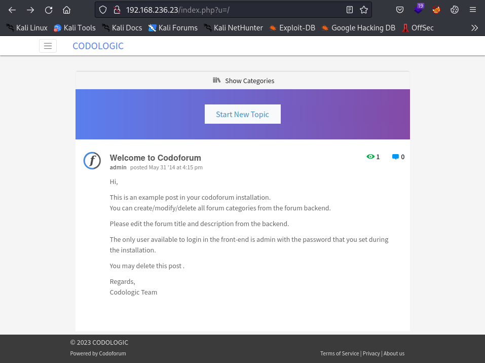
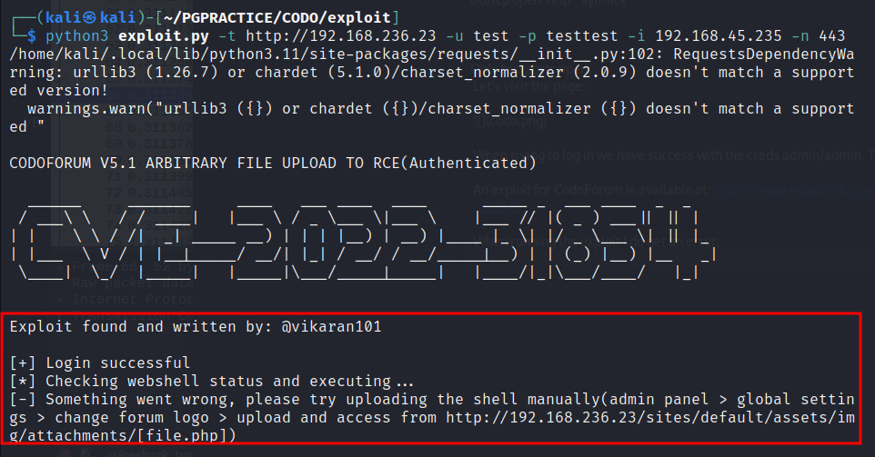
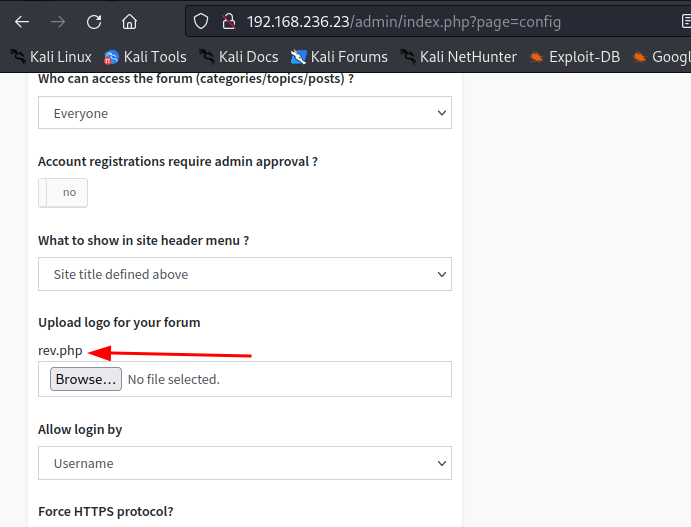
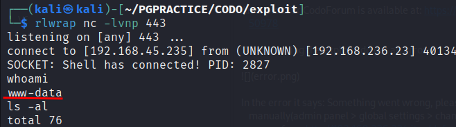
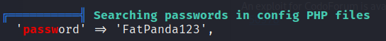
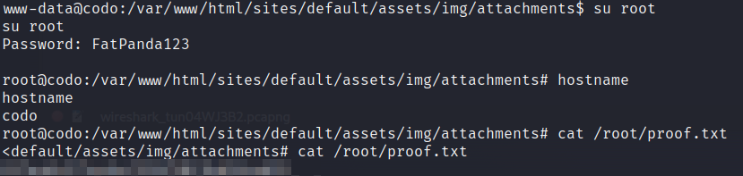

# Codo

OS: Linux

# Nmap

```sh
PORT   STATE SERVICE REASON
22/tcp open  ssh     syn-ack
80/tcp open  http    syn-ack

```

Only two ports open:
 Let's visit the page:
 
 
 
 When trying to log in we have success with the creds admin/admin. That's great.
 
 An exploit for CodoForum is available at: https://www.exploit-db.com/exploits/50978
 
 When running the exploit I do get an error.
 
 
 
 In the error it says: Something went wrong, please try uploading the shell manually(admin panel > global settings > change forum logo > upload and access from http://192.168.236.23/sites/default/assets/img/attachments/[file.php])

That is worth trying.

The shell I upload is the one from revshells.com; PHP Ivan Sincek.
We can login at: http://192.168.236.23/admin/ and go to the config page http://192.168.236.23/admin/index.php?page=config.
Uploading the shell is done at the “Upload logo for your forum” 



We can start a listener and trigger the shell at 192.168.236.23/sites/default/assets/img/attachments/rev.php.



Boom we have a shell as www-data!

# Privilege escalation
When enumerating with linpeas we find a password in a php config file:


Now we can try to switch to user root with this password:


Yes it worked.

## ALWAYS AVOID PASSWORD REUSE!

 
