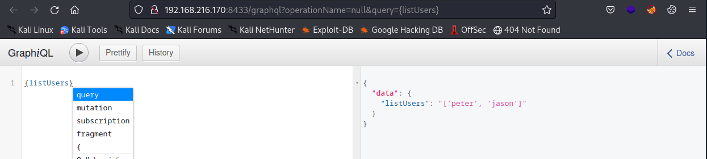
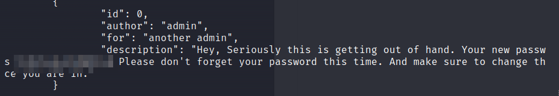

# nmap
Four Ports: 22,80,5132,8433
```sh
PORT     STATE SERVICE REASON  VERSION
22/tcp   open  ssh     syn-ack OpenSSH 8.2p1 Ubuntu 4ubuntu0.3 (Ubuntu Linux; protocol 2.0)
| ssh-hostkey: 
|   3072 c1:99:4b:95:22:25:ed:0f:85:20:d3:63:b4:48:bb:cf (RSA)
| ssh-rsa AAAAB3NzaC1yc2EAAAADAQABAAABgQDH6PH1/ST7TUJ4Mp/l4c7G+TM07YbX7YIsnHzq1TRpvtiBh8MQuFkL1SWW9+za+h6ZraqoZ0ewwkH+0la436t9Q+2H/Nh4CntJOrRbpLJKg4hChjgCHd5KiLCOKHhXPs/FA3mm0Zkzw1tVJLPR6RTbIkkbQiV2Zk3u8oamV5srWIJeYUY5O2XXmTnKENfrPXeHup1+3wBOkTO4Mu17wBSw6yvXyj+lleKjQ6Hnje7KozW5q4U6ijd3LmvHE34UHq/qUbCUbiwY06N2Mj0NQiZqWW8z48eTzGsuh6u1SfGIDnCCq3sWm37Y5LIUvqAFyIEJZVsC/UyrJDPBE+YIODNbN2QLD9JeBr8P4n1rkMaXbsHGywFtutdSrBZwYuRuB2W0GjIEWD/J7lxKIJ9UxRq0UxWWkZ8s3SNqUq2enfPwQt399nigtUerccskdyUD0oRKqVnhZCjEYfX3qOnlAqejr3Lpm8nA31pp6lrKNAmQEjdSO8Jxk04OR2JBxcfVNfs=
|   256 0f:44:8b:ad:ad:95:b8:22:6a:f0:36:ac:19:d0:0e:f3 (ECDSA)
| ecdsa-sha2-nistp256 AAAAE2VjZHNhLXNoYTItbmlzdHAyNTYAAAAIbmlzdHAyNTYAAABBBI0EdIHR7NOReMM0G7C8zxbLgwB3ump+nb2D3Pe3tXqp/6jNJ/GbU2e4Ab44njMKHJbm/PzrtYzojMjGDuBlQCg=
|   256 32:e1:2a:6c:cc:7c:e6:3e:23:f4:80:8d:33:ce:9b:3a (ED25519)
|_ssh-ed25519 AAAAC3NzaC1lZDI1NTE5AAAAIDCc0saExmeDXtqm5FS+D5RnDke8aJEvFq3DJIr0KZML
80/tcp   open  http    syn-ack nginx 1.18.0 (Ubuntu)
|_http-server-header: nginx/1.18.0 (Ubuntu)
| http-methods: 
|_  Supported Methods: GET HEAD OPTIONS
|_http-title: Under Maintainence
5132/tcp open  unknown syn-ack
| fingerprint-strings: 
|   DNSStatusRequestTCP, DNSVersionBindReqTCP, NULL: 
|     Enter Username:
|   GenericLines, GetRequest, HTTPOptions, RTSPRequest: 
|     Enter Username: Enter OTP: Incorrect username or password
|   Help: 
|     Enter Username: Enter OTP:
|   RPCCheck: 
|     Enter Username: Traceback (most recent call last):
|     File "/opt/depreciated/messaging/messages.py", line 100, in <module>
|     main()
|     File "/opt/depreciated/messaging/messages.py", line 82, in main
|     username = input("Enter Username: ")
|     File "/usr/lib/python3.8/codecs.py", line 322, in decode
|     (result, consumed) = self._buffer_decode(data, self.errors, final)
|     UnicodeDecodeError: 'utf-8' codec can't decode byte 0x80 in position 0: invalid start byte
|   SSLSessionReq: 
|     Enter Username: Traceback (most recent call last):
|     File "/opt/depreciated/messaging/messages.py", line 100, in <module>
|     main()
|     File "/opt/depreciated/messaging/messages.py", line 82, in main
|     username = input("Enter Username: ")
|     File "/usr/lib/python3.8/codecs.py", line 322, in decode
|     (result, consumed) = self._buffer_decode(data, self.errors, final)
|     UnicodeDecodeError: 'utf-8' codec can't decode byte 0xd7 in position 13: invalid continuation byte
|   TerminalServerCookie: 
|     Enter Username: Traceback (most recent call last):
|     File "/opt/depreciated/messaging/messages.py", line 100, in <module>
|     main()
|     File "/opt/depreciated/messaging/messages.py", line 82, in main
|     username = input("Enter Username: ")
|     File "/usr/lib/python3.8/codecs.py", line 322, in decode
|     (result, consumed) = self._buffer_decode(data, self.errors, final)
|_    UnicodeDecodeError: 'utf-8' codec can't decode byte 0xe0 in position 5: invalid continuation byte
8433/tcp open  http    syn-ack Werkzeug httpd 2.0.2 (Python 3.8.10)
|_http-server-header: Werkzeug/2.0.2 Python/3.8.10
|_http-title: Site doesn't have a title (text/html; charset=utf-8).
| http-methods: 
|_  Supported Methods: OPTIONS HEAD GET

```

# Port 80
Whatweb summary:  Bootstrap[4.1.1], HTML5, HTTPServer[Ubuntu Linux][nginx/1.18.0 (Ubuntu)], JQuery[3.2.1], nginx[1.18.0], Script


The page shows us a message that we have  to use the CLI application on port 5132, which was open according to our nmap scan

In the page source we see a note which gives us extra information:

```html
	<!--commenting the code until we fix the whole application-->
   <!--<div class="row">-->
      <!--<div class="col-lg-4 col-sm-offset-2">-->
         <!--<div class="panel panel-primary">-->
            <!--<div class="panel-heading">Login</div>-->
            <!--<div class="panel-body">-->
               <!--<div class="col-md-6">-->
		       <!--<form method="post" 
                     <!--<div class="form-group">-->
                        <!--<label for="uname">Username</label>-->
                        <!--<input type="text" placeholder="username" name="uname" class="form-control"><br>-->
                        <!--<label for="pswd">Password</label>-->
                        <!--<input type="text" placeholder="password" name="pswd" class="form-control"><br>-->
                        <!--<button class="btn btn-primary" type="submit">Submit</button>-->
                     <!--</div>-->
                  <!--</form>-->
               <!--</div>-->
            <!--</div>-->
            <!--<div class="panel-footer">-->
               <!--<center>-->
                  <!--<p style="font-size:2em;color: black">    </p>-->
               <!--</center>-->
            <!--</div>-->
         <!--</div>-->
      <!--</div>-->
   <!--</div>-->
   ```

Especially the url in the action form is something we can work with. We only have to change the localhost address to the external address of the machine.

Further investigation does not reveal anything more info.

# 5132
We can connect to the port using nc:

```sh
nc -nvv 192.168.216.170 5132
```
The program tells us to enter a username and otp. unfortunately we don't know this:


# 8433

As we saw in the html comment on the webserver of port 80 pointing to /graphql? directory of port 8433. Only then the ip was localhost.

When we first visit the page we see that the API is working. I don't know which api


If we visit page http://192.168.216.170:8433/graphql we se a Graphiql interface:


>GraphQL acts as an alternative to REST API. Rest APIs require the client to send multiple requests to different endpoints on the API to query data from the backend database. With graphQL you only need to send one request to query the backend

A good explanation of pentesting graphql is found [here](https://book.hacktricks.xyz/network-services-pentesting/pentesting-web/graphql)

If we send the query: {__schema{types{name,fields{name,args{name,description,type{name,kind,ofType{name, kind}}}}}}}

We can see some interesting queries we can do!:


With the listUsers we might get some usernames to getOTP, which requires a username.



Yes we have two usernames: Jason and Peter.


Now let's try to get an OTP to login to the application on port 5132


{getOTP(username:"peter")}


Yes we have an OTP! Now use this to login to port 5132:


Yes! This worked!

Now let's poke around a bit!

because of the ‘$’ it looks like we have a shell. But thats not the case. If we type ‘help’ we can see that we can list some messages.
If we do that we see a request that peter has to change his password! 


Let's read the message and take a note of that!
We are not authorized to read the other messages.

# Foothold:
We can get a shell if we login as the user peter with the found password.


# Privesc
When enumerating the machine we can see that is /opt/depreciated/messaging/messages.py
running as root:


# Code analysis:

On line 19  we can see that the program opens a file and writes it to /opt/depreciated/. Since the program is running as root it could be any file on the system. 

```python
    12  def create_message(user):
    13      for_ = input("for: ")
    14      description = input("Description: ")
    15      num = random.randint(1000, 9999)
    16      author = user
    17      attachment = input("File: ")
    18
    19      if attachment and attachment != "none" and os.path.exists(attachment):
    20          with open(attachment, 'r') as f:
    21              data = f.read()
    22          basename = '/opt/depreciated/' + os.path.basename(attachment)
    23
    24          with open(basename, 'w') as f:
    25              f.write(data)
    26      else:
    27          attachment = "none"
    28      msg_info = {'id': num, 'author': author, 'description': description, 'for': for_, 'attachment': attachment}
    29      MESSAGES.append(msg_info)

```
## Method 1

Give as attachement the file /opt/depreciated/messaging/msg.json


and read it in the /opt/depreciated/ directory we can find the root password.




## Method 2

in line 67 we can see that we can read messages where the loggedin user is the author of the message or the message is sent to the loggin user.
Or... is the user is admin.


```pyhton3
    59          elif "read" in cmd.lower():
    60              try:
    61                  _, message_id = cmd.lower().split()
    62              except ValueError:
    63                  print("Please provide a valid message id")
    64                  continue
    65              try:
    66                  for message in MESSAGES:
    67                      if message["id"] == int(message_id) and (user == message["author"] or user in message["for"] or user == "admin"):
    68                          if "attachment" in message:
    69                              attach = message['attachment']
    70                          else:
    71                              attach = "none"
    72                          print(f'Message No: #{message["id"]}\n\n{message["description"]}\n\nAttachment: {attach}')
    73                          break

```

So how to we log in as admin:
The program reads the /opt/depreciated/code.txt file and splits the line at the “:”.
The part before the semicolon wil be the name and the part after the password.

```python3
    82      username = input("Enter Username: ")
    83      OTP = input("Enter OTP: ")
    84
    85      with open("/opt/depreciated/code.txt", "r") as f:
    86          data = f.readline()
    87      try:
    88          name,password = data.split(":")
    89      except ValueError:
    90          print("Incorrect username or password")
    91          exit(1)
    92
    93      if (username.strip() == name.strip()) and (OTP.strip() == password.strip()):
    94          terminal(name)

````
So only thing we have to do is create a new code.txt in a directory we can write with the user admin and a random password:


```sh
$ echo "admin:admin" > /home/peter/code.txt
```

Now login at port 5132 again as the user peter and the obtained otp:
Most important here is the File input:


after this is finished we can login to port 5132 with username "admin" and otp "admin" and read the message with id 0:


# Root

Now switch to the root user:


