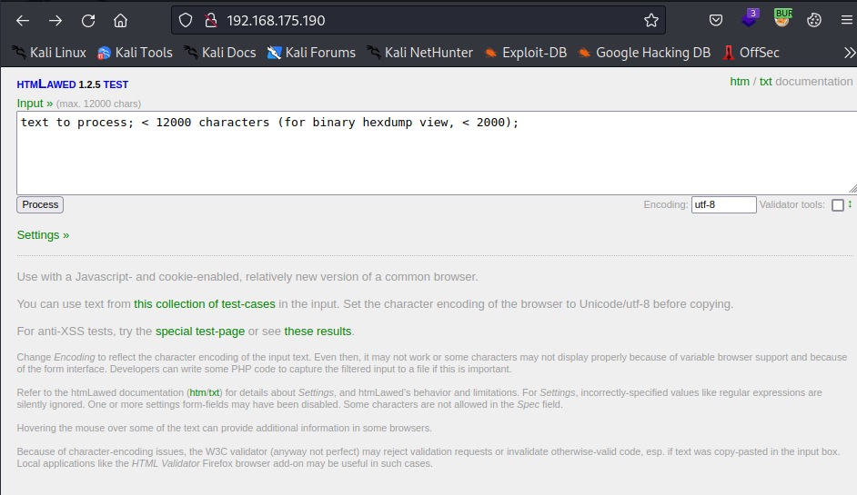
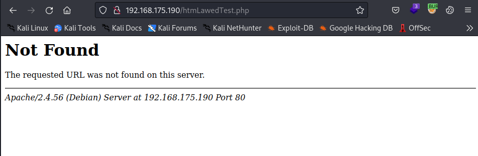
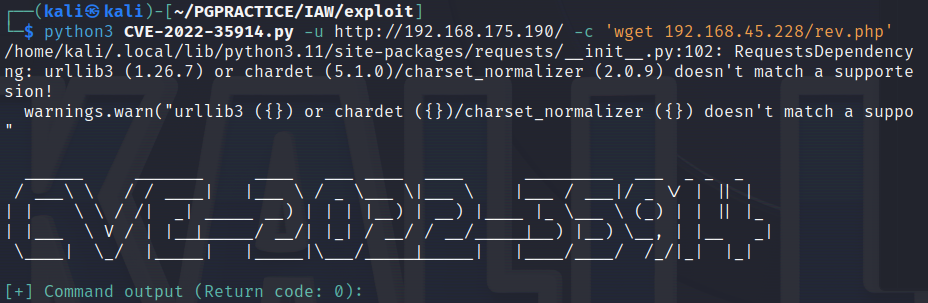
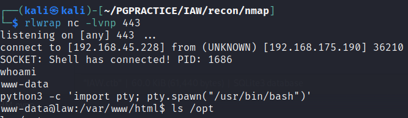
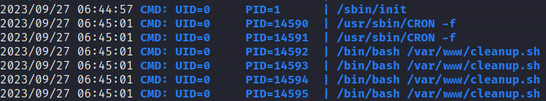
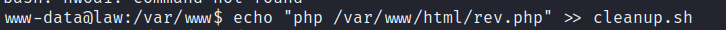
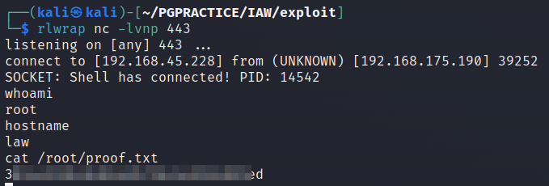

# Iaw

OS: Linux

# NMAP Script and service scan

On this machine we see only ports 22 and 80 open.
```sh
PORT   STATE SERVICE REASON  VERSION
22/tcp open  ssh     syn-ack OpenSSH 8.4p1 Debian 5+deb11u1 (protocol 2.0)
| ssh-hostkey: 
|   3072 c9c3da15283bf1f89a36df4d366ba744 (RSA)
| ssh-rsa AAAAB3NzaC1yc2EAAAADAQABAAABgQDNEbgprJqVJa8R95Wkbo3cemB4fdRzos+v750LtPEnRs+IJQn5jcg5l89Tx4junU+AXzLflrMVo55gbuKeNTDtFRU9ltlIu4AU+f7lRlUlvAHlNjUbU/z3WBZ5ZU9j7Xc9WKjh1Ov7chC0UnDdyr5EGrIwlLzgk8zrWx364+S4JqLtER2/n0rhVxa9RCw0tR/oL24kMep4q7rFK6dThiRtQ9nsJFhh6yw8Fmdg7r4uohqH70UJurVwVNwFqtr/86e4VSSoITlMQPZrZFVvoSsjyL8LEODt1qznoLWudMD95Eo1YFSPID5VcS0kSElfYigjSr+9bNSdlzAof1mU6xJA67BggGNu6qITWWIJySXcropehnDAt2nv4zaKAUKc/T0ij9wkIBskuXfN88cEmZbu+gObKbLgwQSRQJIpQ+B/mA8CD4AiaTmEwGSWz1dVPp5Fgb6YVy6E4oO9ASuD9Q1JWuRmnn8uiHF/nPLs2LC2+rh3nPLXlV+MG/zUfQCrdrE=
|   256 26032bf6da901d1bec8d8f8d1e7e3d6b (ECDSA)
| ecdsa-sha2-nistp256 AAAAE2VjZHNhLXNoYTItbmlzdHAyNTYAAAAIbmlzdHAyNTYAAABBBCUhhvrIBs53SApXKZYHWBlpH50KO3POt8Y+WvTvHZ5YgRagAEU5eSnGkrnziCUvDWNShFhLHI7kQv+mx+4R6Wk=
|   256 fb43b2b0192fd3f6bcaa6067abc1af37 (ED25519)
|_ssh-ed25519 AAAAC3NzaC1lZDI1NTE5AAAAIN4MSEXnpONsc0ANUT6rFQPWsoVmRW4hrpSRq++xySM9
80/tcp open  http    syn-ack Apache httpd 2.4.56 ((Debian))
| http-methods: 
|_  Supported Methods: GET HEAD POST OPTIONS
|_http-title: htmLawed (1.2.5) test
|_http-server-header: Apache/2.4.56 (Debian)
Service Info: OS: Linux; CPE: cpe:/o:linux:linux_kernel


```

# Port 80
When visiting the webpage we see the name of the software and a version number HTMLAWED 1.2.5:



If we play around with on the page and press ‘process’ we get a message that http://192.168.175.190/htmLawedTest.php is not found. The app seems to be broken.



During the directory fuzzing no more pages were found. I guess this is waht we have to work with.

After investigation we find that this version is vulnerable to command injection [CVE-2022-35914](https://nvd.nist.gov/vuln/detail/cve-2022-35914)

Since htmLawedTest.php  was not available I tried to POST do index.php and it worked!


To exploit this vulnerability we can use [this](https://github.com/cosad3s/CVE-2022-35914-poc/blob/main/CVE-2022-35914.py) exploit. You only have to change the uri in line 37 to “/index.php”

to get a shell I upload a PHP script to the webroot with wget and requested this file.




So now we have a shell as user www-data 



# Privilege Escalation
We can monitor all processes with pspy64 and we see that '/bin/bash /var/www/cleanup.sh' gets executed. 




Now we will put some code we want to get executed to the cleanup.sh script. We can use the same reverse shell as before.



Yeah!!

